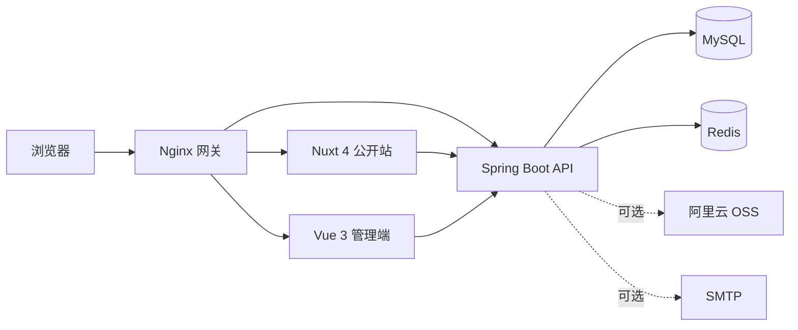

# CageWang's Blog

一个面向个人创作与长期维护的全栈博客系统。项目包含 Nuxt SSR 公开站、Vue 管理端和 Spring Boot API，并提供评论互动、内容审核、访问统计、媒体管理、缓存、安全防护及生产运维能力。

## 核心能力

### 内容与展示

- 文章草稿、定时发布、撤回、归档、置顶与乐观锁
- Markdown 安全渲染、实时预览、自动保存和阅读时长统计
- 分类、标签、搜索、归档及响应式内容发现页面
- SSR、Canonical、Open Graph、JSON-LD、RSS、Sitemap 和 robots.txt
- 深色模式、移动端适配及减少动画偏好支持

### 互动与管理

- 匿名点赞、文章评论、两级回复及重复提交防护
- 评论审核、垃圾标记、隐藏和管理员回复
- 管理仪表盘、热门文章、审核队列和服务状态
- 管理操作审计日志与邮件通知 Outbox
- 阿里云 OSS 图片上传、引用保护和孤儿媒体清理

### 性能与安全

- Redis Cache Aside、版本化缓存键、TTL 抖动和主动失效
- PV/UV 原子计数、来源分类及定时写回 MySQL
- JWT Access Token、Refresh Cookie Rotation 和会话撤销
- 接口限流、一次性算术验证码、请求 Trace ID
- CSP、HSTS、Permissions-Policy、敏感邮箱加密与脱敏

## 系统架构



| 层级 | 技术 |
| --- | --- |
| 公开站 | Nuxt 4、Vue 3、TypeScript |
| 管理端 | Vue 3、Vite、Pinia、Vue Router、Element Plus |
| 后端 | Java 25、Spring Boot 4.1、MyBatis、Flyway |
| 数据 | MySQL 9.7、Redis 8.8 |
| 网关与部署 | Nginx、Docker Compose |
| 测试与质量 | JUnit、Testcontainers、Vitest、Playwright、Lighthouse、k6 |

## 快速开始

### 前置条件

- Docker Desktop 29 或更高版本
- Docker Compose

### 1. 准备配置

```powershell
Copy-Item .env.example .env
```

启动前至少修改以下配置：

| 变量 | 说明 |
| --- | --- |
| `MYSQL_PASSWORD` | 应用数据库密码 |
| `MYSQL_ROOT_PASSWORD` | MySQL root 密码 |
| `REDIS_PASSWORD` | Redis 密码 |
| `JWT_SECRET` | JWT 密钥，至少 32 字节 |
| `ADMIN_INITIAL_USERNAME` | 首次初始化管理员用户名 |
| `ADMIN_INITIAL_PASSWORD` | 首次初始化管理员密码，至少 12 位 |

`ADMIN_INITIAL_PASSWORD` 只在用户表为空时使用。管理员创建成功后，请从部署环境中删除该变量并重建后端容器。

### 2. 启动服务

```powershell
docker compose up --build -d
docker compose ps
```

首次启动会构建三个应用镜像，并由 Flyway 自动完成数据库迁移。

### 3. 访问应用

| 服务 | 地址 |
| --- | --- |
| 公开站 | <http://localhost/> |
| 管理端 | <http://admin.localhost/> |
| 管理员登录 | <http://admin.localhost/login> |
| API 状态 | <http://localhost/api/v1/status> |
| Swagger UI | <http://localhost/docs> |
| 健康检查 | <http://localhost/actuator/health> |
| 隐私说明 | <http://localhost/privacy> |

若端口 80 已被占用，可在 `.env` 中设置 `HTTP_PORT=8088`。

停止服务：

```powershell
docker compose down
```

如需同时删除本地数据库和 Redis 数据，请确认数据不再需要后执行：

```powershell
docker compose down -v
```

## 可选服务

未配置 OSS 或 SMTP 时，博客的核心内容功能仍可正常运行。

### 阿里云 OSS

配置 `OSS_REGION`、`OSS_ENDPOINT`、`OSS_BUCKET`、`OSS_ACCESS_KEY_ID` 和 `OSS_ACCESS_KEY_SECRET` 后可启用媒体上传。建议使用仅允许访问指定 Bucket 与 `OSS_OBJECT_PREFIX` 的最小权限 RAM 用户。

### 邮件通知

设置 `MAIL_ENABLED=true`，并配置 `MAIL_HOST`、`MAIL_PORT`、`MAIL_USERNAME`、`MAIL_PASSWORD` 和 `MAIL_FROM`，即可启用评论回复邮件通知。

## 本地开发

脱离应用容器开发时需要：

- Node.js 24、npm 11
- JDK 25、Maven 3.9+
- Docker（运行 MySQL、Redis 和 Testcontainers）

安装前端依赖：

```powershell
npm ci
```

分别在两个终端中启动前端开发服务器：

```powershell
npm run dev:web
npm run dev:admin
```

后端可在 IDE 中导入 `backend/pom.xml`，并运行 `BlogApplication`。完整的本地环境变量和调试步骤见[本地运行手册](docs/runbook.md)。

## 测试

前端快速检查：

```powershell
npm test
npm run typecheck
npm run build
```

后端测试：

```powershell
Set-Location backend
mvn verify
```

后端集成测试会通过 Testcontainers 启动独立的 MySQL 和 Redis。E2E、OpenAPI、Lighthouse 与性能测试命令见[测试与质量门禁](docs/testing.md)。

## 项目结构

```text
.
├── backend/                 Spring Boot API、迁移与 MyBatis Mapper
├── frontend/
│   ├── web/                 Nuxt SSR 公开站
│   ├── admin/               Vue 管理端
│   └── packages/api-client/ 共享 API 客户端
├── deploy/                  Nginx 配置与运维脚本
├── docs/                    API、数据库、测试和部署文档
├── tests/                   前端单元、E2E 与性能测试
├── docker-compose.yml       本地完整环境
└── docker-compose.prod.yml  单机生产环境
```

## 进一步阅读

- [本地运行手册](docs/runbook.md)
- [测试与质量门禁](docs/testing.md)
- [生产部署、备份与恢复](docs/production.md)
- [数据库说明](docs/database.md)
- [OpenAPI 规范](docs/openapi.yaml)
- [系统设计文档](个人博客系统设计文档.md)

## 致谢

功能范围与视觉方向参考了 MIT 许可的 FeiTwnd-Website；本项目未直接复用其代码或资源。
