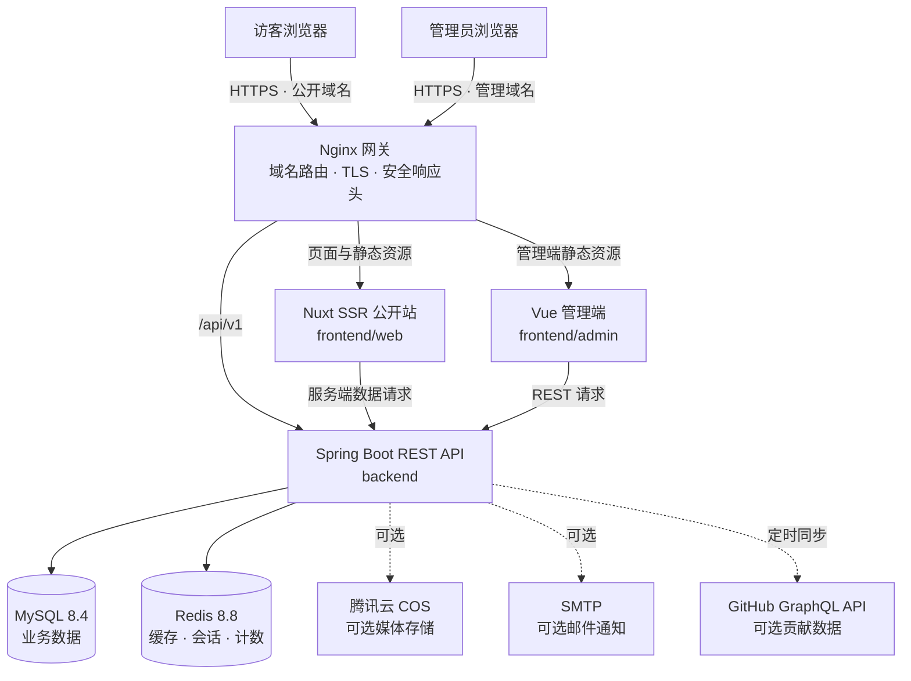

<div align="center">

<pre>
██╗    ██╗██╗███╗   ██╗███████╗ ██████╗██╗      ██████╗ ██╗   ██╗██████╗ ███████╗
██║    ██║██║████╗  ██║██╔════╝██╔════╝██║     ██╔═══██╗██║   ██║██╔══██╗██╔════╝
██║ █╗ ██║██║██╔██╗ ██║█████╗  ██║     ██║     ██║   ██║██║   ██║██║  ██║███████╗
██║███╗██║██║██║╚██╗██║██╔══╝  ██║     ██║     ██║   ██║██║   ██║██║  ██║╚════██║
╚███╔███╔╝██║██║ ╚████║███████╗╚██████╗███████╗╚██████╔╝╚██████╔╝██████╔╝███████║
 ╚══╝╚══╝ ╚═╝╚═╝  ╚═══╝╚══════╝ ╚═════╝╚══════╝ ╚═════╝  ╚═════╝ ╚═════╝ ╚══════╝
                  The self-hosted content platform for creators
</pre>

**面向个人创作者的全栈自托管博客与内容运营平台**

把写作、发布、互动、媒体管理和站点运营放进同一套系统，同时保留对数据、域名与部署环境的完整控制。

<p>
  <a href="package.json"></a>
  <a href="frontend/web/package.json"></a>
  <a href="frontend/web/package.json"></a>
  <a href="backend/pom.xml"></a>
  <a href="backend/pom.xml"></a>
  <a href="https://wineclouds.cn"></a>
  <a href="#开发者文档"></a>
</p>

[**访问在线示例**](https://wineclouds.cn) · [功能概览](#功能概览) · [开发者文档](#开发者文档) · [源码仓库](https://github.com/Wineclouds04/Wineclouds04-Website)

</div>

## 这是什么

Wineclouds04 Website 不只是一个博客页面，而是一套可以长期维护的个人内容平台。访客看到的是清爽、响应式的文章站；站长使用独立管理后台完成写作、发布、评论审核、媒体管理和数据查看；底层则由完整的 API、数据库、缓存与部署工具支撑。

它适合希望建立个人主页、技术博客、作品记录或长期数字档案，并愿意自行掌握内容和运行环境的创作者与开发者。

## 在线示例

### [wineclouds.cn](https://wineclouds.cn)

这是本项目的公开运行示例，可以直接体验首页、文章阅读、分类、标签、归档、搜索、主题切换、评论互动与响应式布局。

> 在线示例展示公开站能力。管理后台、服务器配置和真实数据不会公开。

## 功能概览

| 面向访客 | 面向创作者 | 面向运维 |
| --- | --- | --- |
| 文章、分类、标签、归档与搜索 | Markdown 写作、预览与自动保存 | Docker Compose 一键编排 |
| 响应式布局、明暗主题与动效偏好 | 草稿、定时发布、置顶、撤回与归档 | Nginx 网关与 HTTPS 配置 |
| 匿名点赞、两级评论与文章导航 | 分类、标签、媒体和评论统一管理 | MySQL 备份、恢复与恢复演练 |
| RSS、Sitemap、robots.txt 与 SEO 元数据 | 站点资料、音乐、统计和趋势看板 | 健康检查、日志与 Prometheus 指标 |

### 公开站体验

- Nuxt SSR 输出，兼顾首屏体验、内容可发现性和社交分享
- 文章详情、上一篇/下一篇、相关文章、分类、标签、归档与站内搜索
- RSS 订阅、Sitemap、robots.txt 和完整页面元数据
- 明暗主题、移动端适配和“减少动画”系统偏好支持
- 匿名点赞、两级评论、公开统计和 GitHub 贡献日历
- 可配置 GitHub、抖音、B 站和小红书等公开入口

### 内容管理体验

- 独立管理域名与基于 JWT 的登录会话
- Markdown 编辑、实时预览、自动保存和文章全生命周期管理
- 分类、标签、媒体资源、评论审核与管理员回复
- 站点资料、音乐播放器、访问统计、热门内容与趋势数据配置
- 操作日志、验证码、访问限流和会话撤销

---

## 开发者文档

- [系统架构](#系统架构)
- [技术栈](#技术栈)
- [项目结构](#项目结构)
- [快速开始](#快速开始)
- [本地开发](#本地开发)
- [配置说明](#配置说明)
- [生产部署](#生产部署)
- [备份与恢复](#备份与恢复)
- [健康检查与排障](#健康检查与排障)
- [安全说明](#安全说明)

## 系统架构



### 请求链路

| 请求 | 处理路径 |
| --- | --- |
| 公开页面 | 浏览器 → Nginx → Nuxt SSR → Spring Boot API |
| 管理页面 | 浏览器 → Nginx → Vue 静态站 → Spring Boot API |
| 业务数据 | Nginx `/api/v1/*` → Spring Boot → MySQL / Redis |
| 媒体上传 | 管理端 → Spring Boot → 腾讯云 COS（启用时） |
| 评论通知 | Spring Boot Outbox → SMTP（启用时） |

本地编排只向宿主机公开 Nginx 的 `80` 端口；生产编排只公开 Nginx 的 `80/443`。MySQL、Redis、后端和两个前端服务均位于 Docker 内部网络。

## 技术栈

| 层级 | 主要技术 |
| --- | --- |
| 公开站 | Nuxt 4.4、Vue 3.5、TypeScript 6、Nitro SSR |
| 管理端 | Vue 3.5、Vite 8.1、Pinia 3、Vue Router 4、ECharts 6.1 |
| 后端 | Java 25、Spring Boot 4.1、Spring Security、MyBatis 4、Flyway |
| 数据层 | MySQL 8.4、Redis 8.8 |
| 基础设施 | Docker Compose v2、Nginx 1.28、Bash、PowerShell |
| 可选服务 | 腾讯云 COS、SMTP、GitHub GraphQL API、Prometheus |

具体依赖版本以各模块的 `package.json`、`package-lock.json` 和 `backend/pom.xml` 为准。

## 项目结构

```text
.
├── backend/
│   ├── src/main/java/              Spring Boot 业务代码
│   │   └── com/example/blog/       文章、鉴权、评论、媒体、统计等模块
│   ├── src/main/resources/
│   │   ├── db/migration/           Flyway 数据库迁移
│   │   ├── mapper/                 MyBatis XML Mapper
│   │   └── application*.yml        应用配置
│   ├── src/test/                   后端测试
│   ├── Dockerfile
│   └── pom.xml
├── frontend/
│   ├── web/                        Nuxt SSR 公开站
│   ├── admin/                      Vue/Vite 管理端
│   └── packages/api-client/        前端共享 API 客户端
├── deploy/
│   ├── nginx/                      本地配置与生产模板
│   ├── scripts/                    预检、发布、打包、备份和恢复脚本
│   └── tests/                      部署与界面回归检查
├── docs/                           项目规范与服务器升级手册
├── artifacts/releases/             本地生成的发布包，不提交
├── docker-compose.yml              本地完整栈
├── docker-compose.prod.yml         生产环境覆盖配置
├── .env.example                    本地配置模板
├── .env.production.example         生产配置模板
├── package.json                    npm workspace 根配置
└── README.md
```

## 快速开始

最简单的体验方式是使用 Docker Compose 启动完整系统。

### 前置条件

- Git
- Docker Desktop，或 Docker Engine + Docker Compose v2
- 至少为 Docker 分配 4 GB 可用内存

只有进行源码开发时才需要额外安装 Node.js 24+、npm 11+、JDK 25 和 Maven 3.9+。

### 1. 获取源码

```powershell
git clone https://github.com/Wineclouds04/Wineclouds04-Website.git
Set-Location Wineclouds04-Website
```

### 2. 创建本地配置

PowerShell：

```powershell
Copy-Item .env.example .env
```

Bash：

```bash
cp .env.example .env
```

首次启动前至少修改以下项目：

| 配置 | 说明 |
| --- | --- |
| `MYSQL_PASSWORD` / `MYSQL_ROOT_PASSWORD` | 应用数据库密码与 root 密码 |
| `REDIS_PASSWORD` | Redis 密码 |
| `JWT_SECRET` | 至少 32 字节的随机签名密钥 |
| `ADMIN_INITIAL_USERNAME` | 首次创建的管理员用户名 |
| `ADMIN_INITIAL_PASSWORD` | 首次创建的管理员强密码 |

`.env` 已被 Git 忽略，不要将它提交或发送给他人。

### 3. 启动完整栈

```powershell
docker compose up -d --build --wait
docker compose ps
```

`--wait` 会等待 MySQL、Redis、后端、公开站、管理端和 Nginx 的健康检查完成。

### 4. 打开服务

| 服务 | 地址 | 用途 |
| --- | --- | --- |
| 公开站 | <http://localhost/> | 浏览公开内容 |
| 管理端 | <http://admin.localhost/> | 登录并管理站点 |
| 管理端兼容入口 | <http://localhost/admin/> | 跳转到独立管理域名 |
| API 文档 | <http://localhost/docs> | 开发环境 Swagger UI |
| 网关健康检查 | <http://localhost/healthz> | 检查 Nginx |
| 后端健康检查 | <http://localhost/actuator/health> | 检查 Spring Boot |

管理员只会在 `sys_user` 表为空，且初始用户名和密码均已配置时创建。首次登录成功后，应从运行环境中删除 `ADMIN_INITIAL_USERNAME` 和 `ADMIN_INITIAL_PASSWORD`，再重新创建后端容器。

### 常用 Docker 命令

```powershell
# 查看状态
docker compose ps

# 跟踪日志
docker compose logs -f

# 只查看网关、公开站和后端日志
docker compose logs -f nginx web backend

# 应用代码或配置更新
docker compose up -d --build --wait

# 停止并删除容器，保留数据库与 Redis 命名卷
docker compose down
```

> `docker compose down -v` 会删除 MySQL 和 Redis 数据卷。除非明确要清空全部本地数据，否则不要执行。

## 本地开发

### 前端开发

先保留 Docker 完整栈运行，让开发服务器通过本地 Nginx 访问 API：

```powershell
npm ci

# 终端 1：Nuxt 公开站
npm run dev:web

# 终端 2：Vue 管理端
npm run dev:admin
```

| 开发服务 | 默认地址 |
| --- | --- |
| Nuxt | <http://localhost:3000/> |
| Vite | <http://localhost:5173/> |
| Docker 网关与 API | <http://localhost/> |

Nuxt 和 Vite 的开发代理默认都通过 `http://localhost` 的 Nginx 网关访问 `/api`。如果更改网关端口或直接运行后端，需要同步调整 `frontend/web/nuxt.config.ts` 和 `frontend/admin/vite.config.ts` 的代理目标。

### 后端开发

直接运行后端需要本机可访问的 MySQL 和 Redis，并通过环境变量提供连接信息：

```powershell
$env:MYSQL_HOST = "localhost"
$env:MYSQL_PORT = "3306"
$env:MYSQL_DATABASE = "personal_blog"
$env:MYSQL_USERNAME = "blog"
$env:MYSQL_PASSWORD = "<your-local-password>"
$env:REDIS_HOST = "localhost"
$env:REDIS_PORT = "6379"
$env:REDIS_PASSWORD = "<your-local-password>"
$env:JWT_SECRET = "<at-least-32-random-characters>"

Set-Location backend
mvn spring-boot:run
```

默认地址为 `http://localhost:8080`。Flyway 会在启动时校验并执行尚未应用的数据库迁移。

### 检查与构建

```powershell
# 所有前端 workspace 类型检查
npm run typecheck

# 构建两个前端
npm run build:web
npm run build:admin

# 后端测试与打包
Set-Location backend
mvn test
mvn package
```

## 配置说明

### 配置文件

| 文件 | 作用 | 是否提交 |
| --- | --- | --- |
| `.env.example` | 本地 Docker 示例 | 是，只能包含占位值 |
| `.env` | 本地真实配置 | 否 |
| `.env.production.example` | 生产配置模板 | 是，只能包含占位值 |
| `.env.production` | 服务器真实配置 | 否 |

### 核心配置组

| 配置组 | 关键变量 |
| --- | --- |
| 数据库 | `MYSQL_DATABASE`、`MYSQL_USERNAME`、`MYSQL_PASSWORD`、`MYSQL_ROOT_PASSWORD` |
| Redis | `REDIS_USERNAME`、`REDIS_PASSWORD` |
| 登录与会话 | `JWT_SECRET`、`ACCESS_TOKEN_TTL`、`REFRESH_TOKEN_TTL` |
| 公开站与域名 | `SITE_URL`、`PUBLIC_HOST`、`PUBLIC_WWW_HOST`、`ADMIN_HOST` |
| 首次管理员 | `ADMIN_INITIAL_USERNAME`、`ADMIN_INITIAL_PASSWORD`、`ADMIN_INITIAL_NICKNAME` |
| 缓存与统计 | `CACHE_ENABLED`、各类 `*_CACHE_TTL`、`STATISTICS_FLUSH_INTERVAL` |

### 可选集成

- **腾讯云 COS**：配置 `COS_REGION`、`COS_BUCKET`、`COS_SECRET_ID`、`COS_SECRET_KEY` 后启用媒体上传。Bucket 名称需包含 AppId 后缀。
- **SMTP**：设置 `MAIL_ENABLED=true`，并配置 `MAIL_HOST`、`MAIL_PORT`、账号、密码和发件地址后启用评论回复通知。
- **GitHub 贡献图**：设置 `GITHUB_ENABLED=true`、`GITHUB_USERNAME` 和仅存放在服务端的 `GITHUB_TOKEN`。
- **公开社交入口**：`NUXT_PUBLIC_SOCIAL_*` 变量会发送到浏览器，只能填写公开主页 URL，不能保存任何密钥。

完整字段、默认值和注释见 [`.env.example`](.env.example) 与 [`.env.production.example`](.env.production.example)。

## 生产部署

生产方案面向安装了 Docker Engine 与 Docker Compose v2 的 Linux 服务器。基础编排由 `docker-compose.yml` 提供，`docker-compose.prod.yml` 负责生产镜像、HTTPS、域名和安全覆盖。

### 1. 准备域名、配置和证书

1. 将公开域名、`www` 域名和管理域名解析到服务器。
2. 复制 `.env.production.example` 为 `.env.production`，填写所有真实值，并保持 Linux LF 换行。
3. 将 TLS 文件放入不会提交的 `deploy/certs/`：
   - `public-fullchain.pem`、`public-privkey.pem`
   - `admin-fullchain.pem`、`admin-privkey.pem`
4. 将 `BACKUP_DIR` 设置为仓库外的绝对路径，并配置独立的 `BACKUP_ENCRYPTION_PASSWORD`。
5. 放行服务器的 `80/443` 入站流量。

生产预检会拒绝空值、示例密码、短 JWT、CRLF 配置、缺失证书、仓库内备份目录和无效 Compose 配置。

### 2. 校验生产配置

```bash
chmod +x deploy/scripts/*.sh
./deploy/scripts/preflight.sh 2026.07.22.1
```

版本号必须使用不可变的 `YYYY.MM.DD.N` 格式，每次发布都使用新版本号。

### 3. 发布

```bash
./deploy/scripts/deploy.sh 2026.07.22.1
```

发布脚本会：

1. 执行生产预检；
2. 在已有 MySQL 容器时先创建加密备份；
3. 构建带版本号的后端、公开站和管理端镜像；
4. 使用生产 Compose 重新创建服务；
5. 等待所有健康检查通过；
6. 将成功版本写入 `.release-version`。

生产环境只有 Nginx 暴露 `80/443`，数据库、缓存、API 与前端容器不直接暴露到公网。

### 4. 发布后验证

```bash
docker compose \
  --env-file .env.production \
  -f docker-compose.yml \
  -f docker-compose.prod.yml \
  ps

curl --fail --silent --show-error https://your-domain.example/healthz
curl --fail --silent --show-error https://your-domain.example/actuator/health
```

如果是向既有服务器发布源码更新，建议先生成经过白名单筛选和凭据扫描的发布包：

```powershell
$version = "2026.07.22.1"
pwsh .\deploy\scripts\package-release.ps1 -Version $version
tar -tzf ".\artifacts\releases\wineclouds-deploy-$version.tar.gz"
```

上传、校验、同步、回滚和 SSH 密钥配置见 [生产服务器升级手册](docs/deployment/server-upgrade.md)。

## 备份与恢复

备份脚本读取服务器上的 `.env.production`，使用 `BACKUP_ENCRYPTION_PASSWORD` 加密 MySQL 导出，并将结果写入仓库外的 `BACKUP_DIR`。

```bash
# 创建加密备份
./deploy/scripts/backup-mysql.sh

# 先在临时数据库中执行恢复演练
./deploy/scripts/restore-drill.sh /secure/backups/personal-blog.sql.gz.enc

# 确认演练通过后，恢复到明确指定的数据库
RESTORE_CONFIRM=personal_blog_restore \
  ./deploy/scripts/restore-mysql.sh \
  /secure/backups/personal-blog.sql.gz.enc \
  personal_blog_restore
```

恢复操作会改写目标数据库。不要直接对生产库试跑；先恢复到隔离数据库，检查表结构、迁移状态和关键数据，再决定切换方案。备份还应配置异地副本和定期恢复演练。

## 健康检查与排障

### 查看服务与日志

```powershell
docker compose ps
docker compose logs --tail=100 nginx web backend mysql redis
```

### 常见问题

| 现象 | 检查方向 |
| --- | --- |
| `localhost` 无法打开 | 检查 Docker Desktop、Nginx 状态和宿主机 `80` 端口占用 |
| `admin.localhost` 无法打开 | 确认使用完整域名，并检查本机 DNS/代理软件是否改写 `.localhost` |
| 前端页面出现 API 错误 | 检查 `backend` 健康状态、Nginx `/api` 路由和后端日志 |
| 后端启动失败 | 检查 MySQL/Redis 密码、`JWT_SECRET` 长度和 Flyway 迁移日志 |
| 生产预检拒绝配置 | 按错误提示检查占位值、LF 换行、证书文件和外部备份目录 |
| 构建后页面仍是旧版本 | 重新构建对应镜像，并检查浏览器缓存和静态资源缓存头 |

本地 API 文档默认开启在 `/docs`；生产模板默认关闭 Swagger，仅公开必要的健康端点。

## 安全说明

- 不要提交 `.env`、`.env.production`、Token、密码、数据库连接串或云服务密钥。
- 不要提交 TLS/SSH 私钥、数据库备份、日志、构建产物和本地发布包。
- `JWT_SECRET` 应使用至少 32 字节的独立随机值，不能复用数据库密码。
- 腾讯云 COS 和 GitHub Token 应使用最小权限凭据，并只存在服务器环境中。
- 初始管理员密码只用于空数据库首次启动，首次登录后应从环境中移除。
- 若凭据曾出现在提交、发布包或日志中，应立即在服务提供方撤销或轮换；仅删除文件不能消除泄露风险。
- 发布前建议运行 `git diff --check`、检查暂存文件，并确认示例配置中没有真实值。

项目文件的保留、忽略与发布边界见 [项目文件管理规范](docs/project-organization.md)。

## 参与项目

欢迎通过 [Issues](https://github.com/Wineclouds04/Wineclouds04-Website/issues) 报告问题或提出建议。提交代码前，请说明变更目的、影响模块、配置变化和验证方式，并确保不包含任何真实凭据或个人数据。
