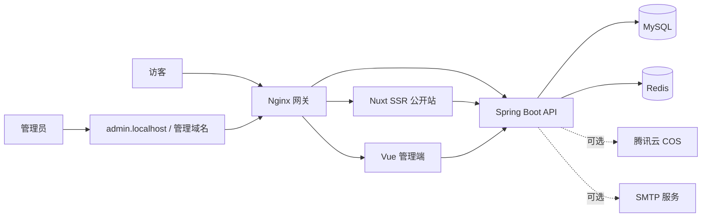

# Wineclouds04 Website

Wineclouds04 是一个面向个人创作与长期运营的自托管博客系统。它由 Nuxt SSR 公开站、Vue 管理端和 Spring Boot API 组成，覆盖内容发布、评论互动、媒体管理、访问统计与基础运维。

本仓库只保存可公开的源码、运行/部署配置和无凭据示例。真实环境变量、私钥、证书、备份、构建产物和本地测试文件均不纳入版本控制。

## 目录

- [核心能力](#核心能力)
- [系统架构](#系统架构)
- [技术栈](#技术栈)
- [快速开始](#快速开始)
- [本地开发](#本地开发)
- [环境变量](#环境变量)
- [生产部署](#生产部署)
- [备份与恢复](#备份与恢复)
- [项目结构](#项目结构)
- [安全与提交规则](#安全与提交规则)

## 核心能力

### 公开站

- Nuxt SSR 渲染、响应式布局、明暗主题与减少动画偏好支持
- 文章详情、分类、标签、搜索、归档与上一篇/下一篇导航
- RSS、Sitemap、robots.txt 与面向搜索引擎的页面元数据
- 匿名点赞、两级评论和公开站点资料/统计展示
- 可配置 GitHub、抖音、B 站和小红书等公开社交入口

### 内容运营

- Markdown 预览、自动保存、草稿、定时发布、撤回、置顶与归档
- 分类、标签、文章、媒体资源与评论的统一后台管理
- 评论审核、垃圾标记、管理员回复与操作日志
- 站点资料、访问统计、热门文章和趋势数据的管理仪表盘

### 平台与运维

- MySQL 持久化、Flyway 数据库迁移与 Redis 缓存/会话/计数
- JWT Access Token、Refresh Cookie Rotation、会话撤销、验证码和限流
- CSP、HSTS、常用安全响应头及 Actuator 健康检查
- 可选腾讯云 COS 媒体存储、SMTP 通知和 Prometheus 指标
- Docker Compose、Nginx 网关、数据库备份、恢复与恢复演练脚本

## 系统架构



| 模块 | 主要职责 | 默认入口 |
| --- | --- | --- |
| `frontend/web` | 文章阅读、搜索、SEO、订阅与公开互动 | `http://localhost/` |
| `frontend/admin` | 内容、媒体、评论、统计与站点运营 | `http://admin.localhost/` |
| `backend` | REST API、鉴权、业务逻辑、迁移与缓存 | `http://localhost/api/v1/` |
| `mysql` / `redis` | 数据持久化、缓存、会话与计数 | Docker 内部网络 |
| `nginx` | 域名路由、反向代理与安全响应头 | 本地 `80`；生产 `80/443` |

## 技术栈

| 层级 | 使用技术 |
| --- | --- |
| 公开站 | Nuxt 4、Vue 3、TypeScript 6 |
| 管理端 | Vue 3、Vite 8、Pinia、Element Plus、ECharts |
| 后端 | Java 25、Spring Boot 4、MyBatis、Flyway、Spring Security |
| 数据服务 | MySQL 8.4、Redis 8 |
| 部署 | Docker Compose、Nginx 1.28、Shell |

## 快速开始

### 前置条件

推荐使用 Docker Desktop（包含 Docker Compose）。本地源码开发还需要：

- Node.js 24+ 与 npm 11+
- JDK 25 与 Maven 3.9+
- MySQL 与 Redis（仅在不使用 Docker Compose 时需要）

### 1. 创建本地环境文件

```powershell
Copy-Item .env.example .env
```

在 `.env` 中修改本地数据库密码、JWT 密钥和首次管理员账号。该文件已被 Git 忽略，不能提交。

> Docker Compose 为方便首次体验提供了开发默认值，但生产环境必须填写强密码和随机 JWT 密钥。

### 2. 构建并启动完整栈

```powershell
docker compose up --build --wait
```

`--wait` 会等待 MySQL、Redis、API、公开站、管理端和 Nginx 的健康检查通过。查看运行状态：

```powershell
docker compose ps
```

### 3. 访问服务

| 服务 | 地址 | 说明 |
| --- | --- | --- |
| 公开站 | http://localhost/ | 首页与公开内容 |
| 管理端 | http://admin.localhost/ | 推荐的管理入口 |
| 管理端兼容入口 | http://localhost/admin/ | 自动跳转至管理端域名 |
| API 状态 | http://localhost/api/v1/status | 轻量服务状态 |
| API 文档 | http://localhost/docs | 开发环境默认开启 |
| 网关健康检查 | http://localhost/healthz | Nginx 可用性 |
| 后端健康检查 | http://localhost/actuator/health | Spring Boot Actuator |

首次启动时，只有在 `sys_user` 表为空且 `.env` 配置了 `ADMIN_INITIAL_USERNAME` 与 `ADMIN_INITIAL_PASSWORD` 才会创建管理员。登录成功后应从部署环境中移除初始密码。

### 日常 Docker 命令

```powershell
# 后台启动或应用配置更新
docker compose up -d --build --wait

# 查看所有服务日志
docker compose logs -f

# 仅查看 API 日志
docker compose logs -f backend

# 停止并删除容器；命名卷会保留数据
docker compose down

# 仅在明确不再需要本地数据库数据时删除命名卷
docker compose down -v
```

## 本地开发

Docker Compose 可单独提供 MySQL、Redis 与 Nginx；也可以使用本机服务。前端是 npm workspace，根目录只需安装一次依赖。

```powershell
# 安装公开站、管理端与共享 API 客户端依赖
npm ci

# 启动公开站
npm run dev:web

# 在另一个终端启动管理端
npm run dev:admin

# 在第三个终端启动后端
Set-Location backend
mvn spring-boot:run
```

默认开发端口如下：

| 服务 | 地址 |
| --- | --- |
| Nuxt 公开站 | http://localhost:3000/ |
| Vite 管理端 | http://localhost:5173/ |
| Spring Boot API | http://localhost:8080/ |

公开站与管理端的 API 访问按照完整环境设计，默认经 Nginx 的 `/api` 转发。若仅运行某一个前端服务，需要同时启动网关或为该服务单独调整 API 代理目标。

### 常用构建命令

```powershell
# 前端类型检查
npm run typecheck

# 构建公开站和管理端
npm run build:web
npm run build:admin

# 构建后端可执行 JAR
Set-Location backend
mvn package
```

## 环境变量

### 配置文件

| 文件 | 用途 | 是否提交 |
| --- | --- | --- |
| `.env.example` | 本地 Docker Compose 示例 | 是，且不得包含真实凭据 |
| `.env` | 本地实际配置 | 否 |
| `.env.production.example` | 生产配置模板 | 是，且不得包含真实凭据 |
| `.env.production` | 服务器实际配置 | 否 |

创建配置文件：

```powershell
Copy-Item .env.example .env
Copy-Item .env.production.example .env.production
```

### 必需的生产变量

| 变量 | 用途 |
| --- | --- |
| `MYSQL_PASSWORD` / `MYSQL_ROOT_PASSWORD` | 应用与数据库 root 密码 |
| `REDIS_PASSWORD` | Redis 访问密码 |
| `JWT_SECRET` | 至少 32 字节的随机签名密钥 |
| `ADMIN_INITIAL_USERNAME` / `ADMIN_INITIAL_PASSWORD` | 空用户表首次启动时的管理员凭据 |
| `PUBLIC_HOST` / `PUBLIC_WWW_HOST` / `ADMIN_HOST` | 公开站与管理端的域名 |
| `APP_VERSION` | 不可变的镜像发布版本 |

### 可选集成

**腾讯云 COS**

填写 `COS_REGION`、`COS_BUCKET`、`COS_SECRET_ID` 和 `COS_SECRET_KEY` 后启用媒体上传。Bucket 名称必须包含 AppId 后缀，例如 `blog-1250000000`。建议使用仅能访问指定 Bucket 和对象前缀的最小权限子账号。

**SMTP 邮件通知**

将 `MAIL_ENABLED=true`，并填写 `MAIL_HOST`、`MAIL_PORT`、`MAIL_USERNAME`、`MAIL_PASSWORD` 与 `MAIL_FROM`，即可启用评论回复通知。未配置时，博客核心功能仍可正常运行。

**公开社交链接**

`NUXT_PUBLIC_SOCIAL_*` 变量会被浏览器读取，只能存放公开主页地址，不能存放密码、Token 或云服务密钥。

## 生产部署

生产部署使用基础编排与生产覆盖文件：

```bash
docker compose \
  --env-file .env.production \
  -f docker-compose.yml \
  -f docker-compose.prod.yml \
  config --quiet
```

### 部署前准备

1. 在 Ubuntu 服务器上复制 `.env.production.example` 为 `.env.production` 并填入真实值。
2. 将证书放在 `deploy/certs/`（该目录不会提交）：
   - `public-fullchain.pem` / `public-privkey.pem`：覆盖 `PUBLIC_HOST` 和 `PUBLIC_WWW_HOST`
   - `admin-fullchain.pem` / `admin-privkey.pem`：覆盖 `ADMIN_HOST`
3. 确保 `BACKUP_DIR` 指向仓库外的安全目录，并填写 `BACKUP_ENCRYPTION_PASSWORD`。
4. 确保 DNS 已解析到服务器，并允许 `80/443` 入站流量。

### 发布版本

```bash
chmod +x deploy/scripts/*.sh
./deploy/scripts/deploy.sh 2026.07.17.1
```

部署脚本会在已有 MySQL 容器时先创建备份，再构建应用镜像并使用 Compose 健康检查等待服务可用。生产环境只由 Nginx 暴露 `80/443`；MySQL、Redis、API 和前端服务都保留在内部 Docker 网络。

## 备份与恢复

所有备份操作均读取服务器上的 `.env.production`。备份文件应保存在仓库之外，且应设置访问控制与异地保留策略。

```bash
# 创建加密 MySQL 备份
./deploy/scripts/backup-mysql.sh

# 恢复到指定数据库；RESTORE_CONFIRM 必须与目标数据库名一致
RESTORE_CONFIRM=personal_blog_restore \
  ./deploy/scripts/restore-mysql.sh /secure/backups/personal-blog.sql.gz.enc personal_blog_restore

# 在临时数据库执行恢复演练
./deploy/scripts/restore-drill.sh /secure/backups/personal-blog.sql.gz.enc
```

恢复会改写目标数据库。请先在隔离环境完成恢复演练，确认无误后再处理正式数据。

## 项目结构

```text
.
├── backend/
│   ├── src/main/java/          Spring Boot 控制器、服务、实体与配置
│   └── src/main/resources/     Flyway 迁移、MyBatis Mapper 与应用配置
├── frontend/
│   ├── web/                    Nuxt SSR 公开站
│   ├── admin/                  Vue 管理端
│   └── packages/api-client/    前端共享 API 客户端
├── deploy/
│   ├── nginx/                  本地 Nginx 配置与生产模板
│   └── scripts/                发布、备份、恢复与演练脚本
├── docker-compose.yml          本地完整栈编排
├── docker-compose.prod.yml     生产覆盖编排
├── .env.example                本地安全示例
├── .env.production.example     生产安全示例
├── package.json                npm workspace 根命令
└── README.md                   项目入口文档
```

## 安全与提交规则

请勿提交或上传以下内容：

- `.env`、`.env.production`、Token、密码、数据库连接串、云服务密钥
- TLS 私钥、证书、SSH 私钥、备份文件或数据库导出
- `node_modules/`、`target/`、`.nuxt/`、`.output/`、`dist/`、缓存、日志和压缩包
- 测试文件、审计/设计资料、本地 IDE 配置和运行时生成文件

提交前建议检查：

```powershell
git status --ignored
git diff --check
git diff --cached --name-only
```

确认暂存区仅包含源码、必要运行配置、README 与无凭据示例文件后再推送。若凭据曾被意外提交，应立即在对应平台撤销或轮换，而不是只在 Git 历史中删除文本。
