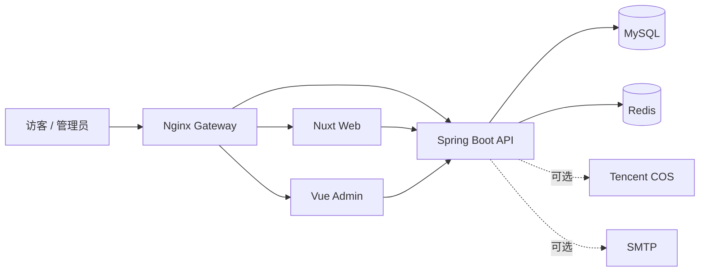

# Wineclouds’Blog

一个面向个人创作、内容管理与长期维护的全栈博客系统。

Wineclouds’Blog 由 Nuxt SSR 公开站、Vue 管理端和 Spring Boot API 组成。它不仅提供文章展示，也覆盖写作、发布、互动、媒体、统计与审计等完整内容工作流。


## 项目概览

公开站采用 Windows 11 Fluent Design 风格，通过响应式毛玻璃界面、明暗主题和沉浸式背景呈现内容。管理端用于处理日常内容运营，后端负责鉴权、数据访问、缓存、统计和外部服务集成。

### 阅读体验

- Nuxt SSR 页面与响应式布局
- 文章、分类、标签、搜索和时间归档
- 上一篇/下一篇、RSS、Sitemap 和 robots.txt
- 明暗主题、移动端导航和减少动画偏好支持
- GitHub、抖音、B站和小红书社交入口，可通过本地环境变量配置

### 内容运营

- 草稿、自动保存、Markdown 预览和定时发布
- 撤回、归档、置顶与乐观锁
- 分类、标签、评论和媒体管理
- 评论审核、垃圾标记与管理员回复
- 仪表盘、访问统计和操作日志

### 平台能力

- 匿名点赞与两级评论
- MySQL 持久化与 Flyway 数据库迁移
- Redis 缓存、会话与访问统计
- 腾讯云 COS 媒体上传和生命周期管理
- SMTP 评论回复通知 Outbox

### 安全与运维

- JWT Access Token 与 Refresh Cookie Rotation
- 会话撤销、接口限流和验证码
- CSP、HSTS 与安全响应头
- Actuator 健康检查与 Prometheus 指标
- Nginx 网关配置、数据库备份和恢复脚本

## 系统架构



| 模块 | 主要技术 | 职责 |
| --- | --- | --- |
| 公开站 | Nuxt 4.4、Vue 3.5、TypeScript 6 | SSR 内容展示、互动、SEO 与订阅输出 |
| 管理端 | Vue 3.5、Vite 8、Pinia 3、Element Plus 2 | 内容编辑、审核、媒体与站点运营 |
| 后端 | Java 25、Spring Boot 4.1、MyBatis 4、Flyway | REST API、鉴权、业务逻辑与数据访问 |
| 数据服务 | MySQL、Redis | 持久化、缓存、统计计数与会话状态 |
| 网关与运维 | Nginx、Docker、Shell | 反向代理、容器构建、备份、恢复与发布辅助 |

## 本地开发

### 环境要求

- Node.js 24+
- npm 11+
- JDK 25
- Maven 3.9+
- MySQL
- Redis
- Docker（可选，用于构建服务镜像或运行依赖）

### 1. 安装前端依赖

```powershell
npm ci
```

该命令会安装根 npm workspace 中的公开站、管理端和共享 API Client。

### 2. 创建本地配置

```powershell
Copy-Item .env.example .env
```

至少需要为后端准备以下配置：

| 变量 | 用途 |
| --- | --- |
| `MYSQL_DATABASE` | MySQL 数据库名 |
| `MYSQL_USERNAME` | 应用数据库用户 |
| `MYSQL_PASSWORD` | 应用数据库密码 |
| `REDIS_USERNAME` | Redis 用户名 |
| `REDIS_PASSWORD` | Redis 密码 |
| `JWT_SECRET` | JWT 签名密钥，生产环境至少 32 字节 |
| `ADMIN_INITIAL_USERNAME` | 空用户表首次启动时创建的管理员用户名 |
| `ADMIN_INITIAL_PASSWORD` | 首次管理员密码，至少 12 位 |

`.env` 已被 Git 和 Docker 构建上下文忽略。不要提交密码、Token、访问密钥或个人主页地址。

### 3. 启动后端

确认 MySQL 和 Redis 可访问后运行：

```powershell
Set-Location backend
mvn spring-boot:run
```

后端默认监听 `http://localhost:8080`。

### 4. 启动前端

在两个终端中分别运行：

```powershell
npm run dev:web
```

```powershell
npm run dev:admin
```

| 服务 | 默认地址 |
| --- | --- |
| 公开站开发服务器 | <http://localhost:3000/> |
| 管理端开发服务器 | <http://localhost:5173/> |
| 后端状态 | <http://localhost:8080/api/v1/status> |
| Swagger UI | <http://localhost:8080/docs> |
| Actuator 健康检查 | <http://localhost:8080/actuator/health> |

公开站和管理端的开发代理按完整环境设计，默认通过本机 `80` 端口的 Nginx 网关访问 `/api`。只启动单个前端模块时，页面可以运行，但依赖 API 的功能需要同时配置网关或调整本地代理目标。

## 社交入口配置

首页个人卡片支持四个平台。真实地址只应写入本地 `.env`：

```dotenv
NUXT_PUBLIC_SOCIAL_GITHUB_URL=
NUXT_PUBLIC_SOCIAL_DOUYIN_URL=
NUXT_PUBLIC_SOCIAL_BILIBILI_URL=
NUXT_PUBLIC_SOCIAL_XIAOHONGSHU_URL=
```

这些变量属于公开运行时配置，浏览器可以读取其值，因此不能用于保存密钥。未配置的入口会保留为不可跳转的占位按钮。

## 常用命令

```powershell
# 启动公开站开发服务器
npm run dev:web

# 启动管理端开发服务器
npm run dev:admin

# 构建公开站
npm run build:web

# 构建管理端
npm run build:admin

# 检查所有前端 workspace 的 TypeScript 类型
npm run typecheck
```

后端构建：

```powershell
Set-Location backend
mvn package
```

## Docker 镜像

仓库为三个应用服务分别提供 Dockerfile，以及本地与生产环境的 Docker Compose 编排文件。

```powershell
# Spring Boot API
docker build -t wineclouds-backend -f backend/Dockerfile backend

# Nuxt Web
docker build -t wineclouds-web -f frontend/web/Dockerfile .

# Vue Admin
docker build -t wineclouds-admin -f frontend/admin/Dockerfile .
```

本地完整栈：

```powershell
docker compose up --build --wait
```

生产部署前，在 Ubuntu 服务器上复制 `.env.production.example` 为 `.env.production` 并填入真实值；该文件受 Git 忽略保护。将前台证书（覆盖 `PUBLIC_HOST` 与 `PUBLIC_WWW_HOST`）命名为 `public-fullchain.pem`、`public-privkey.pem`，将后台证书（覆盖 `ADMIN_HOST`）命名为 `admin-fullchain.pem`、`admin-privkey.pem`，再一并放到 `deploy/certs/`，然后执行：

```bash
chmod +x deploy/scripts/*.sh
./deploy/scripts/deploy.sh 2026.07.16.1
```

`docker-compose.prod.yml` 只暴露 Nginx 的 80/443 端口；MySQL、Redis、后端与前端服务都仅在 Docker 网络内通信。首次部署没有旧数据库容器时，发布脚本会跳过部署前备份。

## 可选集成

### 腾讯云 COS

配置 `COS_REGION`、`COS_BUCKET`、`COS_SECRET_ID` 和 `COS_SECRET_KEY` 后可启用媒体上传。Bucket 必须包含 AppId 后缀，例如 `blog-1250000000`；建议使用仅允许访问目标 Bucket 与对象前缀的最小权限子账号或 CAM 角色。

未配置 COS 时，文章、分类、标签和评论等核心功能仍可使用。

### SMTP

设置 `MAIL_ENABLED=true`，并配置 `MAIL_HOST`、`MAIL_PORT`、`MAIL_USERNAME`、`MAIL_PASSWORD` 和 `MAIL_FROM`，即可启用评论回复邮件通知。

## 运维资源

`deploy/` 包含以下辅助资源：

- Nginx 本地配置与生产模板
- 版本发布脚本
- MySQL 备份与恢复脚本
- 恢复演练和冒烟检查脚本

这些脚本面向既定的服务器环境。正式执行前请检查其中的路径、变量和外部依赖。

## 项目结构

```text
.
├── backend/                  Spring Boot API、Flyway 迁移与 MyBatis Mapper
├── frontend/
│   ├── web/                  Nuxt SSR 公开站
│   ├── admin/                Vue 管理端
│   └── packages/api-client/  前端共享 API Client
├── deploy/
│   ├── nginx/                本地与生产 Nginx 配置
│   └── scripts/              发布、备份、恢复与冒烟检查脚本
├── .env.example              公共安全的环境变量模板
├── package.json              npm workspace 与根级命令
└── README.md                 项目入口文档
```

## 隐私与敏感信息

- 不要提交 `.env` 或任何生产环境配置文件。
- 不要在源码、Issue、日志或截图中公开密码、Token 和云服务密钥。
- 个人社交主页通过本地环境变量配置，不应硬编码进公开仓库。
- 首次管理员创建成功后，应从部署环境中删除初始化用户名和密码。
