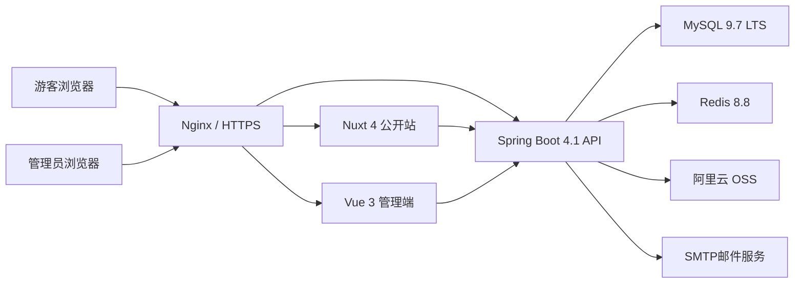
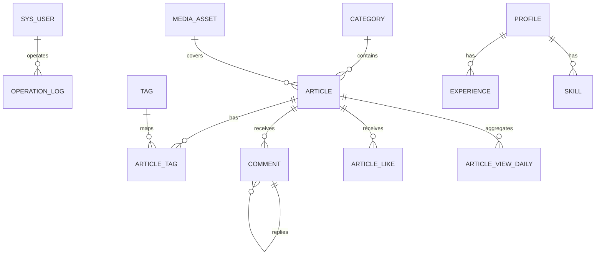
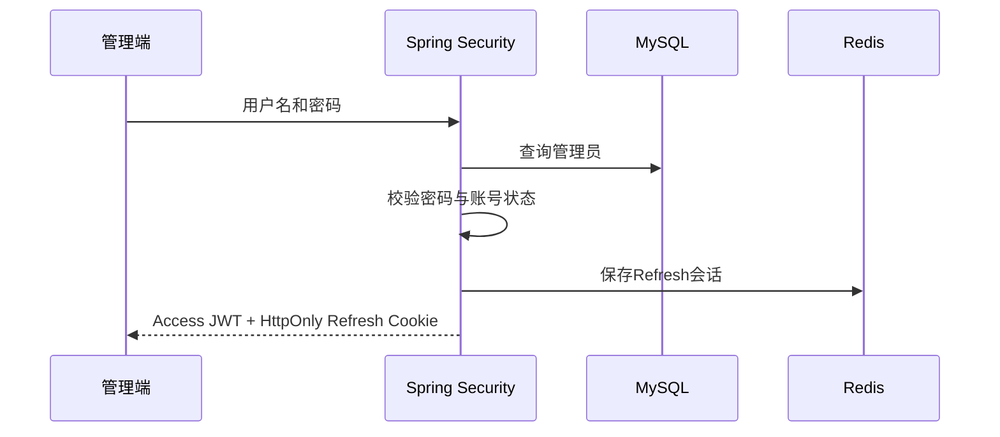
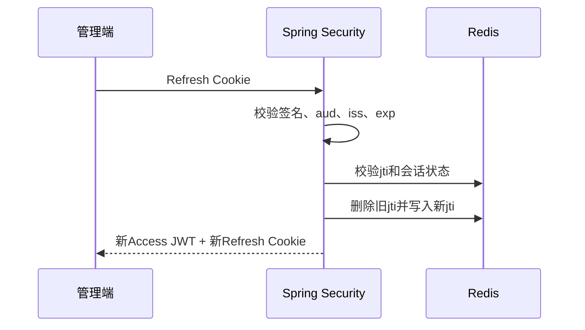
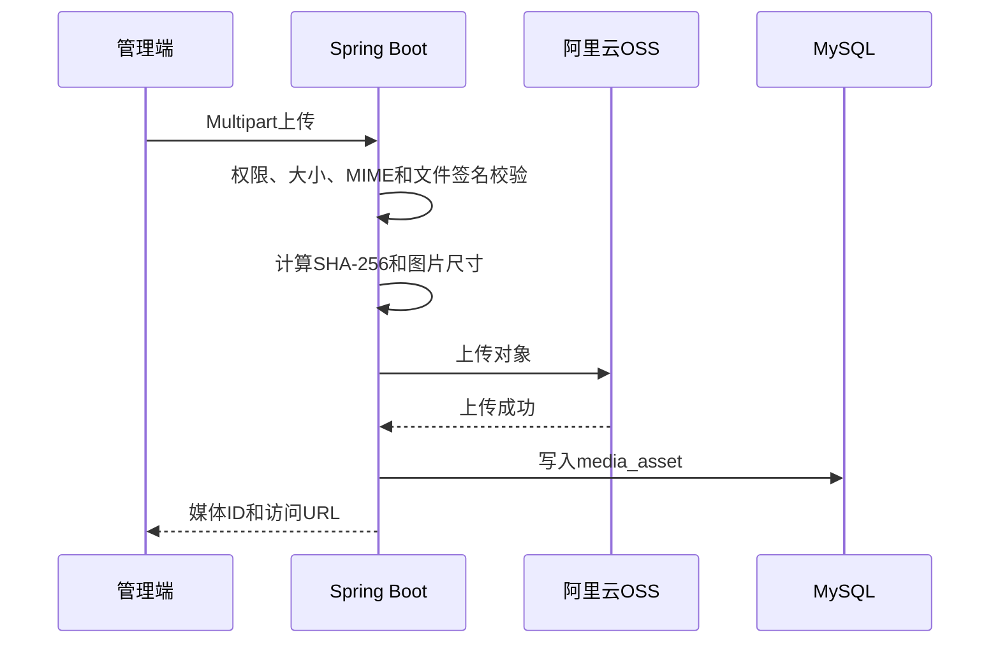

# 个人博客系统设计文档

| 项目 | 内容 |
| --- | --- |
| 文档版本 | 1.0 |
| 编制日期 | 2026-07-01 |
| 项目类型 | 前后端分离的个人博客与个人展示网站 |
| 后端基线 | Java 25 LTS、Spring Boot 4.1、MyBatis、MySQL、Redis |
| 前端基线 | Vue 3、Nuxt 4、TypeScript、Vite |
| 认证方式 | JWT Access Token + JWT Refresh Token + Redis |
| 文件存储 | 阿里云 OSS |
| 参考项目 | FeiTwnd-Website-master（MIT License） |

---

## 1. 文档目的

本文档用于指导个人博客系统从工程初始化、功能开发、数据库设计、接口设计、安全设计到部署运维的全过程。

本文档是开发、测试和验收的共同基线。后续若修改核心架构、数据结构、认证方案或接口契约，应同步更新文档版本。

## 2. 建设目标

系统需要实现以下目标：

1. 提供适合长期写作的博客前台，具备优秀的阅读体验、移动端适配和搜索引擎优化能力。
2. 提供完整的博客管理后台，支持文章、分类、标签、评论、媒体和站点配置管理。
3. 支持个人主页、在线简历、友情链接、留言板、RSS等个人网站能力。
4. 使用Redis提升公开内容访问速度，并支持JWT会话、限流、验证码和统计计数。
5. 使用阿里云OSS存放图片和附件，避免应用服务器承担静态文件持久化职责。
6. 采用模块化单体架构，避免个人项目过早引入微服务、消息队列和复杂基础设施。
7. 保证系统可以通过Docker Compose在单台云服务器稳定部署，并保留横向扩展能力。

## 3. 设计原则

### 3.1 核心原则

- 业务数据以MySQL为最终可信来源。
- Redis只保存缓存、短期状态、会话和可恢复计数。
- OSS保存原始媒体文件，数据库保存媒体元数据和对象键。
- 公开页面优先保证SEO、首屏速度和可访问性。
- 后台优先保证编辑效率、安全性和可维护性。
- 所有数据库结构变更通过Flyway管理。
- 所有API先定义契约，再开发前后端实现。
- 默认采用最小权限、最小暴露面和安全失败原则。

### 3.2 明确不做

第一版不引入：

- 微服务拆分
- Spring Cloud
- Kafka、RabbitMQ
- Elasticsearch
- Kubernetes
- 复杂多租户
- 社交平台式用户体系
- AI自动写作

以上能力只有在真实需求出现后再评估。

## 4. 参考项目取舍

参考项目位于：

`C:\Users\moomman\Downloads\FeiTwnd-Website-master`

### 4.1 保留的设计思想

- 博客首页的大图Hero区域、文章卡片和个人信息侧栏。
- 文章详情页的封面标题区、阅读信息、Markdown正文和悬浮目录。
- 分类、标签、归档、评论、留言、点赞、友链、RSS和暗色模式。
- 管理后台的数据看板、文章编辑、评论审核和操作日志。
- 个人主页和在线简历的功能范围。
- Markdown服务端渲染与HTML清理。
- Redis缓存和浏览量定时同步思路。
- Nginx统一入口和Docker部署方式。

### 4.2 必须重写的部分

- 不沿用自定义MVC JWT拦截器，改用Spring Security过滤器链。
- 不将管理员Token长期保存在`localStorage`。
- 不允许`allowedOriginPatterns("*")`与凭证请求组合。
- 不使用破坏性的`drop database`初始化脚本。
- 不把MySQL、Redis端口直接暴露到公网。
- 不继续使用旧版PageHelper Starter、Fastjson、Commons Lang 2等依赖。
- 不将四个公开Vue SPA完全复制，合并重复代码和公共组件。
- 不强依赖阿里云OSS旧版SDK，使用OSS Java SDK V2。
- 不默认采集可识别用户的浏览器指纹和精确地理位置。

### 4.3 许可证要求

参考项目使用MIT许可证。若直接复用其代码、样式或资源，应在项目中保留原许可证和版权声明；若仅参考功能与布局并重新实现，则在项目说明中标注设计参考来源。

## 5. 用户与角色

### 5.1 游客

游客无需登录，可执行：

- 浏览首页、文章、分类、标签和归档。
- 搜索公开文章。
- 浏览个人主页、简历、友链和关于页面。
- 提交评论、留言和点赞。
- 订阅RSS或邮件通知。

### 5.2 管理员

管理员登录后可执行：

- 管理文章、草稿、分类和标签。
- 上传、引用和删除媒体。
- 审核、回复、隐藏和删除评论、留言。
- 管理友情链接、个人资料、简历、技能和站点设置。
- 查看访问统计和操作日志。
- 修改密码、注销其他设备会话。

### 5.3 访客演示账号

可选提供只读演示管理员角色：

- 允许查看管理后台数据。
- 禁止所有新增、修改、删除、上传和发布操作。
- 权限由Spring Security方法级授权控制，不根据HTTP方法简单判断。

## 6. 功能范围

### 6.1 博客前台

#### 首页

- 顶部导航。
- Hero背景图和个人介绍。
- 置顶文章与最新文章。
- 分类、标签和热门文章。
- 个人信息卡片。
- 文章数、分类数、标签数和访问量。
- 音乐播放器，可配置关闭。
- 深色模式。

#### 文章

- 文章列表和分页。
- 按分类、标签过滤。
- 文章详情。
- 自动目录。
- 上一篇、下一篇。
- 相关文章推荐。
- 阅读量、点赞量、评论量、字数和预计阅读时间。
- Markdown、表格、任务列表、代码块和代码高亮。
- 文章分享信息与Open Graph。

#### 搜索与归档

- 标题、摘要和正文搜索。
- 搜索关键词高亮。
- 按年、月归档。
- 空结果和错误状态提示。

#### 互动

- 文章评论。
- 两级评论回复。
- 评论审核。
- 留言板。
- 文章点赞。
- 邮件回复通知。
- 评论频率限制和验证码。

#### 内容页面

- 关于我。
- 友情链接。
- 个人主页。
- 在线简历。
- RSS Feed。
- Sitemap。
- robots.txt。

### 6.2 管理后台

#### 仪表盘

- 文章、评论、访客和浏览量汇总。
- 最近7天、30天浏览趋势。
- 热门文章排行。
- 待审核评论数量。
- 最近操作记录。
- 服务健康状态。

#### 文章管理

- 新建、编辑、预览和删除。
- 草稿自动保存。
- Markdown编辑器。
- 文章封面上传。
- 分类和标签。
- SEO标题和描述。
- 自定义slug。
- 发布、撤回、置顶和归档。
- 定时发布。
- 修改slug后的301重定向。

#### 评论与留言

- 分页查询。
- 审核通过、拒绝和垃圾评论标记。
- 管理员回复。
- 批量处理。
- IP匿名摘要和风控信息查看。

#### 媒体管理

- 图片上传。
- 文件类型和尺寸校验。
- 图片预览。
- 未引用文件清理。
- OSS对象删除。
- alt文本和说明维护。

#### 系统配置

- 网站名称、描述、Logo、Favicon。
- 首页背景、头像和社交链接。
- 评论开关、审核策略。
- 邮件配置状态。
- RSS配置。
- 备案信息。
- 页脚内容。

## 7. 技术选型

版本基线为2026-07-01。项目初始化时应再次核对官方稳定版本，并通过锁文件固定实际版本。

### 7.1 后端

| 技术 | 版本/策略 | 用途 |
| --- | --- | --- |
| Java | 25 LTS | 运行时与开发语言 |
| Spring Boot | 4.1.x | 应用框架 |
| Spring Framework | 由Boot BOM管理 | Web、事务、配置 |
| Spring Security | 由Boot BOM管理 | 认证与授权 |
| MyBatis Starter | 4.0.x | SQL映射与数据访问 |
| HikariCP | Boot默认版本 | 数据库连接池 |
| PageHelper | 6.1.x，可选 | 管理后台普通分页 |
| MySQL Connector/J | Boot BOM管理 | MySQL驱动 |
| Flyway | Boot BOM管理 | 数据库版本迁移 |
| Spring Data Redis | Boot BOM管理 | Redis访问 |
| Lettuce | Boot默认 | Redis客户端 |
| CommonMark Java | 初始化时锁定稳定版 | Markdown解析 |
| jsoup/HTML Sanitizer | 初始化时锁定稳定版 | HTML白名单清理 |
| OSS Java SDK V2 | 初始化时锁定稳定版 | 阿里云OSS |
| Micrometer + Actuator | Boot BOM管理 | 健康检查与指标 |
| JUnit | Boot BOM管理 | 单元测试 |
| Testcontainers | Boot BOM管理 | 集成测试 |

### 7.2 数据与基础设施

| 技术 | 版本/策略 | 用途 |
| --- | --- | --- |
| MySQL | 9.7.x LTS | 业务数据 |
| Redis CE | 8.8.x | 缓存、JWT会话、计数和限流 |
| 阿里云OSS | 托管服务 | 图片和附件 |
| Nginx | 稳定版 | HTTPS与反向代理 |
| Docker Compose | 当前稳定版 | 单机编排 |

若生产云服务暂不支持MySQL 9.7，可暂用MySQL 8.4 LTS，但开发、测试和生产必须保持同一主版本。

### 7.3 前端

| 技术 | 版本/策略 | 用途 |
| --- | --- | --- |
| Node.js | 24 LTS | 前端构建运行时 |
| Vue | 3.5.x | UI框架 |
| Nuxt | 4.4.x | 公开站SSR与SEO |
| TypeScript | Nuxt/Vite兼容稳定版 | 类型系统 |
| Vite | 8.1.x | 管理端构建 |
| Pinia | 稳定版 | 状态管理 |
| Element Plus | 2.14.x | 管理端组件 |
| md-editor-v3 | 稳定版 | Markdown编辑 |
| ECharts | 稳定版 | 管理端图表 |
| Vitest | 稳定版 | 前端单元测试 |
| Playwright | 稳定版 | 端到端测试 |

## 8. 数据访问方案

### 8.1 最终选择

采用：

```text
MyBatis + HikariCP + Flyway
```

PageHelper只用于后台简单分页，不作为所有列表接口的默认实现。

### 8.2 选择原因

- 博客存在归档、搜索、趋势、热门排行等SQL密集场景。
- MyBatis便于控制索引使用和查询字段。
- 参考项目已有大量可供理解业务的SQL，但新项目重新设计Mapper和数据结构。
- HikariCP是Spring Boot默认连接池，轻量、成熟、配置简单。
- Actuator、Micrometer和MySQL慢查询日志可以满足第一版监控需要。

### 8.3 MyBatis规范

- Mapper接口位于对应业务模块内部。
- XML文件与Mapper接口保持同名。
- 禁止`SELECT *`。
- 查询必须明确字段列表。
- 动态SQL必须使用参数绑定，禁止字符串拼接用户输入。
- 单条业务SQL默认超时5秒。
- 管理后台页码分页可以使用PageHelper。
- 公开文章流和大数据列表使用游标分页。
- 复杂统计查询独立放置，不复用普通CRUD查询。
- Mapper集成测试必须使用真实MySQL Testcontainer。

### 8.4 HikariCP建议配置

```yaml
spring:
  datasource:
    url: jdbc:mysql://${MYSQL_HOST}:${MYSQL_PORT}/${MYSQL_DATABASE}?useUnicode=true&characterEncoding=utf8&serverTimezone=UTC
    username: ${MYSQL_USERNAME}
    password: ${MYSQL_PASSWORD}
    hikari:
      pool-name: BlogHikariPool
      minimum-idle: 2
      maximum-pool-size: 10
      connection-timeout: 3000
      validation-timeout: 1000
      idle-timeout: 600000
      max-lifetime: 1500000
      keepalive-time: 300000
```

连接池大小应根据应用实例数和MySQL最大连接数共同计算，不应盲目增大。

## 9. 总体架构



### 9.1 架构形式

后端采用模块化单体：

- 单一部署单元。
- 模块之间通过服务接口或领域事件协作。
- 不允许跨模块直接操作其他模块Mapper。
- 可在未来按真实压力拆分媒体、通知或统计模块。

### 9.2 网络入口

建议域名：

```text
www.example.com       公开站
admin.example.com     管理后台
```

两个站点均通过同域`/api/`反向代理到后端，以降低CORS和Cookie配置复杂度：

```text
https://www.example.com/api/*
https://admin.example.com/api/*
```

## 10. 工程结构

```text
personal-blog/
├─ backend/
│  ├─ pom.xml
│  └─ src/
│     ├─ main/
│     │  ├─ java/com/example/blog/
│     │  │  ├─ BlogApplication.java
│     │  │  ├─ auth/
│     │  │  ├─ article/
│     │  │  ├─ taxonomy/
│     │  │  ├─ comment/
│     │  │  ├─ media/
│     │  │  ├─ interaction/
│     │  │  ├─ profile/
│     │  │  ├─ statistics/
│     │  │  ├─ notification/
│     │  │  ├─ site/
│     │  │  └─ shared/
│     │  └─ resources/
│     │     ├─ application.yml
│     │     ├─ db/migration/
│     │     └─ mapper/
│     └─ test/
├─ frontend/
│  ├─ web/
│  │  ├─ app/pages/
│  │  ├─ app/components/
│  │  ├─ app/composables/
│  │  └─ app/assets/
│  ├─ admin/
│  │  ├─ src/views/
│  │  ├─ src/components/
│  │  ├─ src/api/
│  │  ├─ src/stores/
│  │  └─ src/router/
│  └─ packages/
│     ├─ api-client/
│     ├─ types/
│     └─ shared-ui/
├─ deploy/
│  ├─ nginx/
│  ├─ docker/
│  └─ scripts/
├─ docs/
│  ├─ openapi.yaml
│  ├─ database.md
│  └─ runbook.md
├─ docker-compose.yml
└─ README.md
```

## 11. 后端模块设计

### 11.1 auth

负责：

- 管理员登录。
- JWT签发与校验。
- Refresh Token轮换。
- 会话撤销。
- 密码修改。
- 登录失败限流。
- 权限校验。

### 11.2 article

负责：

- 文章草稿、发布和归档。
- Markdown渲染。
- slug与SEO字段。
- 上一篇、下一篇和相关文章。
- 全文搜索。
- 文章缓存失效。

### 11.3 taxonomy

负责：

- 分类。
- 标签。
- 文章标签关系。
- 分类与标签统计。

### 11.4 comment

负责：

- 文章评论。
- 留言板。
- 评论树。
- 审核与垃圾评论。
- 回复通知。

### 11.5 media

负责：

- OSS上传。
- 媒体元数据。
- 文件校验。
- 引用计数。
- 无效媒体清理。

### 11.6 interaction

负责：

- 文章点赞。
- 匿名访客标识。
- 防重复操作。

### 11.7 statistics

负责：

- 文章浏览计数。
- 站点访问聚合。
- 管理端趋势和排行。
- Redis计数定时落库。

### 11.8 notification

负责：

- 评论回复邮件。
- 订阅确认。
- 文章发布通知。
- 可靠通知Outbox。

### 11.9 profile

负责：

- 个人资料。
- 社交链接。
- 经历。
- 技能。
- 在线简历。

### 11.10 site

负责：

- 网站配置。
- 友情链接。
- RSS。
- Sitemap。
- URL重定向。

## 12. 后端分层约定

每个模块内部采用：

```text
controller
application/service
domain
repository/mapper
dto
model
```

约束：

- Controller只处理协议转换、校验和响应。
- Service负责事务和业务编排。
- Mapper只负责数据库访问。
- Entity/PO不直接暴露到API。
- 请求和响应使用Java Record DTO。
- 时间统一使用`Instant`或`OffsetDateTime`。
- 业务异常转换为RFC 9457 Problem Details。
- 跨模块调用通过公开服务接口完成。

## 13. 数据库设计

### 13.1 通用约定

- 字符集：`utf8mb4`。
- 排序规则：选择MySQL 9.7推荐的Unicode排序规则。
- 主键：`BIGINT`。
- 时间：数据库保存UTC，字段使用`DATETIME(3)`。
- API输出ISO-8601时间。
- 逻辑删除字段：`deleted_at`。
- 乐观锁字段：`version`。
- 状态字段使用`VARCHAR`或`TINYINT`，避免难迁移的MySQL ENUM。
- 索引名称使用`idx_`、唯一索引使用`uk_`。
- 所有DDL通过Flyway执行。
- Flyway迁移文件一经进入生产环境不得修改，只能追加新版本。

### 13.2 ER关系图



### 13.3 核心表

#### sys_user

| 字段 | 类型 | 说明 |
| --- | --- | --- |
| id | BIGINT | 主键 |
| username | VARCHAR(64) | 登录名，唯一 |
| password_hash | VARCHAR(255) | BCrypt/Argon2密码摘要 |
| nickname | VARCHAR(64) | 昵称 |
| email | VARCHAR(160) | 邮箱 |
| role | VARCHAR(32) | ADMIN、DEMO |
| status | VARCHAR(32) | ACTIVE、LOCKED、DISABLED |
| last_login_at | DATETIME(3) | 最近登录时间 |
| password_changed_at | DATETIME(3) | 密码修改时间 |
| created_at | DATETIME(3) | 创建时间 |
| updated_at | DATETIME(3) | 更新时间 |
| version | INT | 乐观锁 |

说明：密码哈希算法已包含盐，不单独存储`salt`字段。

#### article

| 字段 | 类型 | 说明 |
| --- | --- | --- |
| id | BIGINT | 主键 |
| title | VARCHAR(200) | 标题 |
| slug | VARCHAR(160) | URL标识，唯一 |
| summary | VARCHAR(600) | 摘要 |
| content_markdown | LONGTEXT | Markdown源文 |
| content_html | LONGTEXT | 清理后的HTML |
| content_plain | LONGTEXT | 搜索和摘要使用的纯文本 |
| cover_media_id | BIGINT | 封面媒体ID |
| category_id | BIGINT | 分类ID |
| status | VARCHAR(32) | DRAFT、SCHEDULED、PUBLISHED、ARCHIVED |
| visibility | VARCHAR(32) | PUBLIC、PRIVATE |
| is_pinned | TINYINT | 是否置顶 |
| allow_comment | TINYINT | 是否允许评论 |
| word_count | INT | 字数 |
| reading_minutes | INT | 阅读时间 |
| view_count | BIGINT | 聚合浏览量 |
| like_count | BIGINT | 点赞量 |
| comment_count | BIGINT | 已审核评论量 |
| meta_title | VARCHAR(200) | SEO标题 |
| meta_description | VARCHAR(320) | SEO描述 |
| canonical_url | VARCHAR(500) | 规范URL，可空 |
| published_at | DATETIME(3) | 发布时间 |
| scheduled_at | DATETIME(3) | 定时发布时间 |
| created_at | DATETIME(3) | 创建时间 |
| updated_at | DATETIME(3) | 更新时间 |
| deleted_at | DATETIME(3) | 逻辑删除时间 |
| version | INT | 乐观锁 |

索引：

- `uk_article_slug(slug)`
- `idx_article_status_publish(status, published_at DESC)`
- `idx_article_category_status(category_id, status, published_at DESC)`
- `idx_article_pinned_publish(is_pinned, published_at DESC)`
- 中文搜索使用MySQL ngram全文索引，作用于`title、summary、content_plain`。

#### category

| 字段 | 类型 | 说明 |
| --- | --- | --- |
| id | BIGINT | 主键 |
| name | VARCHAR(64) | 名称 |
| slug | VARCHAR(80) | URL标识 |
| description | VARCHAR(300) | 描述 |
| sort_order | INT | 排序 |
| visible | TINYINT | 是否公开 |
| created_at | DATETIME(3) | 创建时间 |
| updated_at | DATETIME(3) | 更新时间 |

`name`和`slug`分别建立唯一索引。

#### tag

字段与分类类似，标签不设置层级。

#### article_tag

| 字段 | 类型 | 说明 |
| --- | --- | --- |
| article_id | BIGINT | 文章ID |
| tag_id | BIGINT | 标签ID |

联合主键或唯一索引：`(article_id, tag_id)`。

#### comment

| 字段 | 类型 | 说明 |
| --- | --- | --- |
| id | BIGINT | 主键 |
| article_id | BIGINT | 文章ID，留言可为空 |
| root_id | BIGINT | 根评论ID |
| parent_id | BIGINT | 父评论ID |
| type | VARCHAR(32) | ARTICLE、MESSAGE |
| content_markdown | TEXT | 原始内容 |
| content_html | TEXT | 清理后的HTML |
| nickname | VARCHAR(64) | 昵称 |
| email_ciphertext | VARBINARY | 加密后的邮箱 |
| website | VARCHAR(300) | 个人网站 |
| anonymous_key_hash | CHAR(64) | 匿名访客标识摘要 |
| status | VARCHAR(32) | PENDING、APPROVED、SPAM、REJECTED |
| is_admin_reply | TINYINT | 管理员回复 |
| notify_on_reply | TINYINT | 是否通知 |
| ip_hash | CHAR(64) | 每日加盐的IP摘要 |
| user_agent_summary | VARCHAR(200) | 精简浏览器信息 |
| created_at | DATETIME(3) | 创建时间 |
| updated_at | DATETIME(3) | 更新时间 |
| deleted_at | DATETIME(3) | 删除时间 |

评论树最大两级，避免无限递归。

#### article_like

| 字段 | 类型 | 说明 |
| --- | --- | --- |
| id | BIGINT | 主键 |
| article_id | BIGINT | 文章ID |
| anonymous_key_hash | CHAR(64) | 匿名访客标识摘要 |
| created_at | DATETIME(3) | 创建时间 |

唯一索引：`(article_id, anonymous_key_hash)`。

#### media_asset

| 字段 | 类型 | 说明 |
| --- | --- | --- |
| id | BIGINT | 主键 |
| object_key | VARCHAR(500) | OSS对象键，唯一 |
| original_name | VARCHAR(255) | 原始文件名 |
| media_type | VARCHAR(100) | MIME类型 |
| extension | VARCHAR(20) | 扩展名 |
| size_bytes | BIGINT | 文件大小 |
| width | INT | 图片宽度 |
| height | INT | 图片高度 |
| sha256 | CHAR(64) | 内容摘要 |
| alt_text | VARCHAR(300) | 替代文本 |
| status | VARCHAR(32) | PENDING、ACTIVE、ORPHAN、DELETED |
| reference_count | INT | 引用计数 |
| created_by | BIGINT | 上传管理员 |
| created_at | DATETIME(3) | 创建时间 |
| deleted_at | DATETIME(3) | 删除时间 |

#### article_view_daily

| 字段 | 类型 | 说明 |
| --- | --- | --- |
| article_id | BIGINT | 文章ID |
| stat_date | DATE | 日期 |
| view_count | BIGINT | 浏览量 |
| unique_count | BIGINT | 匿名去重访问量 |
| updated_at | DATETIME(3) | 更新时间 |

唯一索引：`(article_id, stat_date)`。

#### site_visit_daily

按天保存全站浏览量、匿名访客量和来源聚合，不保存永久原始IP。

#### operation_log

保存管理员、操作模块、动作、目标ID、结果、Trace ID、匿名IP摘要、时间。敏感请求字段必须脱敏。

#### site_config

配置项包括键、JSON值、数据类型、是否公开、描述和版本。

公开站只能读取`is_public = 1`的配置。

#### url_redirect

保存旧slug、目标路径、HTTP状态码和启用状态，用于文章slug修改后的301跳转。

#### notification_outbox

保存待发送邮件：

- 事件类型。
- 收件人密文。
- 邮件模板。
- JSON载荷。
- 状态。
- 重试次数。
- 下次执行时间。

定时任务可靠消费，不引入消息队列。

## 14. API设计

### 14.1 基础约定

- 前缀：`/api/v1`
- 请求和响应：`application/json; charset=UTF-8`
- 上传：`multipart/form-data`
- 时间：ISO-8601 UTC
- ID在JSON中按字符串输出，避免JavaScript大整数精度问题。
- 写操作支持`Idempotency-Key`的场景应进行幂等控制。
- 接口契约维护在`docs/openapi.yaml`。
- Swagger UI仅渲染OpenAPI文件，不依赖生产环境扫描Controller。

### 14.2 成功响应

单个资源直接返回DTO：

```json
{
  "id": "10001",
  "title": "文章标题",
  "slug": "article-slug"
}
```

分页响应：

```json
{
  "items": [],
  "page": 1,
  "size": 20,
  "total": 100,
  "hasNext": true
}
```

游标分页：

```json
{
  "items": [],
  "nextCursor": "opaque-cursor",
  "hasNext": true
}
```

### 14.3 错误响应

使用`application/problem+json`：

```json
{
  "type": "https://example.com/problems/validation-error",
  "title": "请求参数校验失败",
  "status": 400,
  "detail": "title不能为空",
  "instance": "/api/v1/admin/articles",
  "traceId": "01J..."
}
```

### 14.4 公开接口

| 方法 | 路径 | 说明 |
| --- | --- | --- |
| GET | `/public/home` | 首页聚合数据 |
| GET | `/public/articles` | 文章列表 |
| GET | `/public/articles/{slug}` | 文章详情 |
| GET | `/public/articles/{slug}/adjacent` | 上下篇 |
| GET | `/public/articles/{slug}/related` | 相关文章 |
| GET | `/public/categories` | 分类列表 |
| GET | `/public/categories/{slug}/articles` | 分类文章 |
| GET | `/public/tags` | 标签列表 |
| GET | `/public/tags/{slug}/articles` | 标签文章 |
| GET | `/public/archives` | 归档 |
| GET | `/public/search` | 搜索 |
| GET | `/public/articles/{id}/comments` | 评论列表 |
| POST | `/public/articles/{id}/comments` | 提交评论 |
| POST | `/public/articles/{id}/likes` | 点赞 |
| DELETE | `/public/articles/{id}/likes` | 取消点赞 |
| GET | `/public/friend-links` | 友情链接 |
| GET | `/public/profile` | 个人资料 |
| GET | `/public/resume` | 在线简历 |
| POST | `/public/messages` | 提交留言 |
| POST | `/public/subscriptions` | 邮件订阅 |
| GET | `/rss.xml` | RSS |
| GET | `/sitemap.xml` | Sitemap |

### 14.5 认证接口

| 方法 | 路径 | 说明 |
| --- | --- | --- |
| POST | `/auth/login` | 管理员登录 |
| POST | `/auth/refresh` | 刷新JWT |
| POST | `/auth/logout` | 注销当前会话 |
| POST | `/auth/logout-all` | 注销全部会话 |
| GET | `/auth/me` | 当前管理员 |
| PUT | `/auth/password` | 修改密码 |

### 14.6 管理接口

| 方法 | 路径 | 说明 |
| --- | --- | --- |
| GET | `/admin/dashboard` | 仪表盘 |
| GET | `/admin/articles` | 文章分页 |
| GET | `/admin/articles/{id}` | 文章编辑详情 |
| POST | `/admin/articles` | 新建文章 |
| PUT | `/admin/articles/{id}` | 更新文章 |
| POST | `/admin/articles/{id}/publish` | 发布 |
| POST | `/admin/articles/{id}/withdraw` | 撤回 |
| DELETE | `/admin/articles/{id}` | 删除 |
| GET/POST/PUT/DELETE | `/admin/categories/**` | 分类管理 |
| GET/POST/PUT/DELETE | `/admin/tags/**` | 标签管理 |
| GET | `/admin/comments` | 评论分页 |
| POST | `/admin/comments/{id}/approve` | 审核通过 |
| POST | `/admin/comments/{id}/reject` | 拒绝 |
| POST | `/admin/comments/{id}/reply` | 管理员回复 |
| POST | `/admin/media` | 上传媒体 |
| GET | `/admin/media` | 媒体分页 |
| DELETE | `/admin/media/{id}` | 删除媒体 |
| GET/PUT | `/admin/site-config/**` | 系统配置 |
| GET/POST/PUT/DELETE | `/admin/friend-links/**` | 友链管理 |
| GET/PUT | `/admin/profile/**` | 个人资料 |
| GET/POST/PUT/DELETE | `/admin/experiences/**` | 经历管理 |
| GET/POST/PUT/DELETE | `/admin/skills/**` | 技能管理 |
| GET | `/admin/operation-logs` | 操作日志 |

## 15. JWT认证与授权设计

### 15.1 Token模型

#### Access Token

- 类型：JWT。
- 建议有效期：15分钟。
- 前端存储：仅内存中的Pinia Store。
- 传递方式：`Authorization: Bearer <token>`。
- 作用：访问管理API。

#### Refresh Token

- 类型：JWT。
- 建议有效期：7天，可配置到14天。
- 存储：`HttpOnly + Secure + SameSite` Cookie。
- Cookie路径仅允许刷新和注销接口。
- Redis保存有效会话和`jti`。
- 每次刷新执行Refresh Token Rotation。

### 15.2 Access Token Claims

```json
{
  "iss": "personal-blog",
  "aud": "personal-blog-admin",
  "sub": "10001",
  "role": "ADMIN",
  "jti": "uuid",
  "token_type": "access",
  "iat": 0,
  "exp": 0
}
```

JWT内不放置邮箱、密码、昵称等非授权必要数据。

### 15.3 Refresh Token Redis状态

```text
auth:refresh:{jti}
```

值包含：

- 用户ID。
- 会话ID。
- Token摘要。
- 创建时间。
- 过期时间。
- 设备摘要。
- 状态。

Refresh Token被盗后可通过Redis立即撤销，因此本系统不追求完全无状态JWT。

### 15.4 登录流程



### 15.5 刷新流程



### 15.6 前端处理

- Access Token不持久化。
- 页面刷新后调用`/auth/refresh`恢复登录状态。
- 收到401后最多触发一次单飞刷新，其他请求等待结果。
- 刷新失败时清空状态并跳转登录页。
- 不在日志、错误上报和URL中记录Token。

### 15.7 Spring Security要求

- 使用`SecurityFilterChain`。
- 使用JWT Encoder/Decoder，不手写Base64和签名逻辑。
- `/api/v1/admin/**`要求ADMIN或DEMO权限。
- 所有写操作通过方法级授权再次确认。
- DEMO角色禁止写操作。
- 修改密码后撤销所有Refresh会话。
- 登录和刷新接口启用专门限流。

### 15.8 CSRF与CORS

- Access Token通过Authorization Header传递，普通管理API不依赖Cookie认证。
- Refresh Token由Cookie传递，刷新接口必须校验`Origin`/`Referer`和CSRF令牌。
- CORS只允许配置中的明确域名。
- 禁止`*`与`allowCredentials=true`组合。

## 16. 阿里云OSS设计

### 16.1 使用原则

- 使用OSS Java SDK V2。
- AccessKey只存在于服务端环境变量、Docker Secret或RAM角色。
- 前端不得持有长期AccessKey。
- 数据库只保存`object_key`，展示URL由配置的CDN域名拼接。
- Bucket默认私有。
- 通过CDN回源鉴权向公开博客提供图片。

### 16.2 对象键规范

```text
blog/{environment}/{yyyy}/{MM}/{uuid}.{extension}
```

示例：

```text
blog/prod/2026/07/6fd97d6f-9fc5-4af4-a877-84d4b4c8d713.webp
```

对象键不得包含用户原始文件名。

### 16.3 第一版上传流程



第一版由后端转发上传，流程简单且便于安全校验。大文件需求出现后再改为STS临时凭证或预签名直传。

### 16.4 上传限制

- 图片：JPEG、PNG、WebP、GIF，可按需求支持AVIF。
- 默认单图上限：10MB。
- 附件类型使用明确白名单。
- 同时检查扩展名、Content-Type和文件魔数。
- SVG默认禁止；如需支持必须进行严格净化。
- 压缩包和可执行文件默认禁止。
- 图片尺寸设置上限，防止解压缩炸弹。

### 16.5 生命周期

1. 上传后媒体状态为`PENDING`。
2. 文章保存并引用后转为`ACTIVE`。
3. 24小时未引用转为`ORPHAN`。
4. 定时任务清理ORPHAN对象。
5. 管理员删除媒体时先标记`DELETED`，再异步删除OSS对象。
6. OSS删除失败进入重试任务。

### 16.6 RAM权限

应用账号只允许：

- 指定Bucket、指定前缀的PutObject。
- GetObject或生成访问地址。
- DeleteObject。
- 必要的HeadObject。

禁止Bucket管理、跨Bucket访问和全局OSS权限。

## 17. Redis设计

### 17.1 使用范围

- JWT Refresh会话。
- 登录失败次数。
- 验证码。
- 公开内容缓存。
- 浏览量计数。
- 点赞计数辅助。
- 接口限流。
- 草稿自动保存。
- 定时任务分布式锁。

### 17.2 Key规范

```text
{project}:{environment}:{module}:{business-key}
```

示例：

| Key | TTL | 用途 |
| --- | --- | --- |
| `blog:prod:auth:refresh:{jti}` | 7天 | Refresh会话 |
| `blog:prod:auth:user-sessions:{userId}` | 7天 | 用户会话集合 |
| `blog:prod:auth:login-fail:{account}:{ipHash}` | 15分钟 | 登录失败 |
| `blog:prod:cache:article:slug:{slug}` | 10分钟 | 文章详情 |
| `blog:prod:cache:article:list:{queryHash}` | 5分钟 | 文章列表 |
| `blog:prod:cache:taxonomy:all` | 30分钟 | 分类标签 |
| `blog:prod:counter:view:{articleId}:{date}` | 3天 | 浏览量 |
| `blog:prod:rate:comment:{subject}:{window}` | 按窗口 | 评论限流 |
| `blog:prod:draft:{userId}:{articleId}` | 7天 | 自动草稿 |
| `blog:prod:lock:stats-flush` | 1分钟 | 统计同步锁 |

### 17.3 缓存策略

采用Cache Aside：

1. 读取缓存。
2. 未命中时查询MySQL。
3. 写入带随机抖动的TTL。
4. 数据更新事务提交后删除相关缓存。
5. 不在事务提交前删除缓存。

热点文章可使用短期互斥锁防止缓存击穿；空结果缓存30～60秒防止穿透。

### 17.4 序列化

- Key使用字符串。
- 复杂Value使用带版本字段的JSON。
- 不使用Java原生JDK序列化。
- 缓存DTO与数据库PO分离。
- 升级DTO时调整缓存版本前缀。

### 17.5 浏览量同步

- 访问文章时在Redis执行原子计数。
- 使用匿名访客ID和时间窗口进行近似去重。
- 每分钟批量写入`article_view_daily`。
- 使用`INSERT ... ON DUPLICATE KEY UPDATE`保证幂等。
- 同步成功后安全扣减或移动已处理计数。
- Redis数据丢失只影响短期统计，不影响文章本身。

## 18. Markdown与内容安全

### 18.1 保存流程

1. 接收Markdown。
2. 校验长度。
3. 使用CommonMark解析。
4. 对生成HTML执行白名单清理。
5. 提取纯文本。
6. 统计字数和阅读时间。
7. 保存Markdown、HTML和纯文本。
8. 清除相关缓存。

### 18.2 HTML白名单

允许：

- 标题、段落、列表、引用。
- 表格。
- 代码块。
- 安全链接。
- 图片。
- 删除线和任务列表。

禁止：

- `script`。
- `iframe`，除非配置明确允许特定域名。
- `object`、`embed`。
- `on*`事件属性。
- `javascript:`链接。
- 内联危险样式。

外部链接自动增加：

```html
rel="noopener noreferrer nofollow"
```

## 19. 搜索设计

第一版使用MySQL全文索引：

- 搜索字段：标题、摘要、纯文本正文。
- 中文采用ngram全文解析器。
- 搜索结果只返回已发布公开文章。
- 对关键词长度和字符集做限制。
- 搜索接口限流。
- 搜索结果缓存短TTL。

当文章数量或搜索需求超过MySQL能力后，再评估Meilisearch或Elasticsearch。

## 20. 评论与反垃圾

### 20.1 匿名标识

- 首次访问生成随机匿名ID。
- 通过安全Cookie保存。
- 数据库存储匿名ID的HMAC摘要。
- 不使用Canvas、字体等浏览器指纹。

### 20.2 防滥用

- 同一匿名ID、IP摘要按时间窗口限流。
- 首次评论或高风险请求要求验证码。
- 重复内容检测。
- 链接数量限制。
- 敏感词与垃圾特征检查。
- 默认进入PENDING状态。
- 管理员回复可直接通过。

### 20.3 隐私

- 原始IP只用于请求期风控，不长期保存。
- 统计使用每日轮换盐生成摘要。
- 邮箱加密存储，页面只显示脱敏结果。
- 提供隐私说明和数据删除联系方式。

## 21. 前端设计

### 21.1 公开站

公开站使用Nuxt 4和Vue 3。

路由：

```text
/
/blog
/article/[slug]
/category/[slug]
/tag/[slug]
/archive
/search
/links
/message
/about
/resume
```

渲染策略：

- 首页和文章页：SSR并配合短期SWR缓存。
- 分类、标签、归档：SSR。
- 关于、友链等稳定内容：预渲染或SSR。
- 搜索：SSR首屏或客户端请求，视搜索参数而定。
- 登录和管理页面不进入公开Nuxt应用。

### 21.2 管理端

管理端使用Vue 3、Vite、TypeScript和Element Plus。

模块：

```text
views/
  login/
  dashboard/
  articles/
  comments/
  media/
  taxonomy/
  profile/
  settings/
  logs/
```

要求：

- 路由懒加载。
- Element Plus按需加载。
- Markdown编辑器独立分包。
- Access Token只存在内存。
- API客户端统一处理Trace ID、401和刷新流程。
- 表单离开前提示未保存修改。
- 草稿同时保存服务端和本地临时副本。

### 21.3 视觉基线

参考FeiTwnd页面风格，但重新实现：

- 大面积背景Hero。
- 白色或半透明卡片。
- 内容区最大宽度约1200～1400px。
- 正文阅读宽度约760～860px。
- 桌面端双栏、移动端单栏。
- 文章目录在桌面端吸顶。
- 深色模式使用CSS变量统一管理。
- 动画遵守`prefers-reduced-motion`。

### 21.4 SEO

每篇文章生成：

- 独立`title`和`description`。
- canonical URL。
- Open Graph。
- Twitter Card。
- JSON-LD Article。
- 文章发布时间和更新时间。
- 可索引的服务端HTML正文。

同时提供：

- Sitemap。
- RSS。
- robots.txt。
- 自定义404。
- slug变更301跳转。

## 22. 安全设计

### 22.1 密码

- 使用Argon2id或BCrypt。
- BCrypt成本因子至少12，并通过目标服务器压测确定。
- 不记录明文密码。
- 修改密码后撤销全部会话。
- 默认管理员密码不得写入代码或SQL。

### 22.2 输入输出

- Bean Validation校验所有输入。
- MyBatis只使用参数绑定。
- Markdown和评论HTML必须清理。
- 错误响应不暴露堆栈、SQL和内部路径。
- 日志对邮箱、Token、Cookie和AccessKey脱敏。

### 22.3 HTTP安全头

- HSTS。
- Content-Security-Policy。
- X-Content-Type-Options。
- Referrer-Policy。
- Permissions-Policy。
- Frame Ancestors或X-Frame-Options。

### 22.4 限流建议

| 场景 | 初始限制 |
| --- | --- |
| 登录 | 单账号/IP 5次/15分钟 |
| 刷新Token | 单会话30次/分钟 |
| 评论 | 单匿名ID 3次/10分钟 |
| 留言 | 单匿名ID 2次/10分钟 |
| 搜索 | 单IP摘要60次/分钟 |
| 上传 | 单管理员20次/分钟 |

具体阈值上线后根据日志调整。

### 22.5 依赖安全

- 后端使用Spring Boot BOM管理核心依赖。
- 不随意覆盖BOM版本。
- 前端提交`pnpm-lock.yaml`。
- CI执行依赖漏洞扫描。
- 高危漏洞阻断发布。
- 每月安排一次依赖升级窗口。

## 23. 事务与一致性

- 文章、标签关系和媒体引用更新在同一数据库事务中完成。
- 缓存清理在事务提交后执行。
- OSS上传和数据库不是分布式事务，使用状态机和补偿任务。
- 邮件通过Outbox保证最终发送。
- 浏览量和点赞聚合允许最终一致。
- 发布文章时生成HTML、更新状态、写Outbox和清缓存应明确事务边界。

## 24. 定时任务

| 任务 | 周期 | 用途 |
| --- | --- | --- |
| 浏览量同步 | 每分钟 | Redis写入MySQL |
| 定时发布 | 每分钟 | 发布到期文章 |
| Outbox发送 | 每30秒 | 发送通知邮件 |
| 孤儿媒体扫描 | 每小时 | 标记未引用媒体 |
| OSS清理 | 每日 | 删除过期孤儿对象 |
| 统计聚合 | 每日 | 汇总日统计 |
| 会话清理 | Redis TTL | 自动过期 |

多实例运行时使用Redis锁，任务必须可重入、可恢复并具有幂等性。

## 25. 可观测性

### 25.1 日志

- 生产环境输出JSON结构化日志。
- 每个请求生成或透传Trace ID。
- 记录请求路径、方法、状态码、耗时和匿名客户端摘要。
- 不记录请求正文中的敏感字段。
- 操作日志与系统日志分离。

### 25.2 Actuator

仅开放必要端点：

- `/actuator/health`
- `/actuator/info`
- `/actuator/prometheus`，仅内网

其他端点默认关闭或仅内网认证访问。

### 25.3 指标

- JVM内存、GC、线程。
- HTTP请求量、错误率和P95延迟。
- Hikari连接池使用量和等待时间。
- Redis命中率和错误。
- MySQL慢查询。
- JWT刷新失败次数。
- 评论拦截数量。
- OSS上传失败率。
- Outbox积压数量。

## 26. 测试策略

### 26.1 后端测试

#### 单元测试

- Markdown处理。
- slug生成。
- JWT Claims和过期逻辑。
- 权限规则。
- 评论树。
- OSS对象键。
- 缓存键。

#### 集成测试

使用Testcontainers启动与生产同主版本的MySQL和Redis：

- Flyway迁移。
- Mapper SQL。
- 事务与乐观锁。
- PageHelper分页。
- 缓存失效。
- JWT刷新轮换。
- 限流。
- 浏览量同步。

#### API测试

- 参数校验。
- 未认证、未授权。
- DEMO只读。
- 文章发布完整流程。
- 评论审核。
- OSS失败补偿。
- RFC 9457错误格式。

### 26.2 前端测试

- Vitest测试Composable、Store和工具函数。
- Vue Test Utils测试关键组件。
- Playwright覆盖：
  - 登录和Token刷新。
  - 新建、保存、发布文章。
  - 上传图片。
  - 前台浏览文章。
  - 评论提交和后台审核。
  - 深色模式。
  - 移动端主要页面。

### 26.3 安全测试

- XSS载荷。
- SQL注入。
- 越权访问。
- Refresh Token重放。
- 文件类型伪造。
- 超大文件。
- CORS和CSRF。
- 登录暴力破解。
- 开源依赖漏洞扫描。

### 26.4 性能测试

使用k6或同类工具：

- 首页。
- 文章详情。
- 文章列表。
- 搜索。
- 评论提交。
- 登录。

初始目标：

- 缓存命中的公开GET接口P95低于200ms。
- 未缓存文章详情P95低于500ms。
- 5xx错误率低于0.1%。
- 单实例支持个人博客预期峰值的至少5倍。

## 27. 部署设计

### 27.1 Docker Compose服务

```text
nginx
web
admin-static
backend
mysql
redis
```

阿里云OSS和SMTP为外部服务。

### 27.2 网络

- Nginx暴露80和443。
- Backend只在Docker内部网络开放端口。
- MySQL和Redis不映射到公网。
- 管理维护通过SSH隧道或内网访问。
- Redis设置ACL和密码。
- MySQL使用独立低权限应用账号。

### 27.3 Nginx

职责：

- HTTPS终止。
- HTTP到HTTPS跳转。
- Nuxt和管理端路由。
- `/api/`反向代理。
- 上传大小限制。
- 安全响应头。
- 静态资源长缓存。
- WebSocket预留。
- 真实客户端IP可信代理配置。

### 27.4 健康检查

- Backend：Actuator健康端点。
- MySQL：`mysqladmin ping`。
- Redis：`redis-cli ping`并认证。
- Nuxt：HTTP健康页面。
- Nginx：配置检查和HTTP探测。

## 28. 配置与密钥

### 28.1 环境变量

```text
SPRING_PROFILES_ACTIVE
SERVER_PORT

MYSQL_HOST
MYSQL_PORT
MYSQL_DATABASE
MYSQL_USERNAME
MYSQL_PASSWORD

REDIS_HOST
REDIS_PORT
REDIS_USERNAME
REDIS_PASSWORD

JWT_ISSUER
JWT_AUDIENCE
JWT_SECRET_CURRENT
JWT_SECRET_PREVIOUS
JWT_ACCESS_TTL
JWT_REFRESH_TTL

OSS_REGION
OSS_ENDPOINT
OSS_BUCKET
OSS_ACCESS_KEY_ID
OSS_ACCESS_KEY_SECRET
OSS_CDN_DOMAIN

MAIL_HOST
MAIL_PORT
MAIL_USERNAME
MAIL_PASSWORD
MAIL_FROM

PUBLIC_SITE_URL
ADMIN_SITE_URL
ALLOWED_ORIGINS
PII_ENCRYPTION_KEY
IP_HASH_SECRET
```

### 28.2 密钥轮换

- JWT支持当前密钥和上一密钥并存的短期轮换。
- AccessKey优先使用RAM角色或定期轮换。
- PII加密密钥必须有备份和轮换方案。
- `.env`不得提交Git。
- 生产密钥不得出现在Docker镜像和日志。

## 29. 备份与恢复

### 29.1 MySQL

- 每日逻辑或物理备份。
- 保留7个日备份。
- 保留4个周备份。
- 保留12个或至少6个月备份。
- 备份加密后上传独立OSS Bucket。
- 每月至少执行一次恢复演练。

### 29.2 OSS

- 开启版本控制或回收站策略。
- 配置生命周期规则。
- 数据库媒体记录和OSS对象定期对账。
- 备份Bucket与业务Bucket权限隔离。

### 29.3 Redis

- 开启AOF。
- Redis数据可以通过MySQL和业务状态重建。
- 不把文章正文等唯一数据只存Redis。

### 29.4 恢复顺序

1. 恢复MySQL。
2. 检查Flyway版本。
3. 启动Redis并清理不兼容缓存。
4. 校验OSS对象。
5. 启动Backend。
6. 启动前端和Nginx。
7. 执行健康检查和核心业务冒烟测试。

## 30. CI/CD

### 30.1 Pull Request流水线

1. 后端格式检查。
2. 后端单元测试。
3. MySQL/Redis集成测试。
4. 前端Lint和类型检查。
5. 前端单元测试。
6. 前端构建。
7. OpenAPI契约检查。
8. 依赖和镜像漏洞扫描。

### 30.2 主分支流水线

1. 执行全部测试。
2. 构建版本化Docker镜像。
3. 生成SBOM。
4. 推送镜像仓库。
5. 备份生产数据库。
6. 执行Flyway迁移。
7. 滚动或可回退部署。
8. 健康检查。
9. Playwright生产冒烟测试。
10. 失败时回退应用版本；数据库迁移采用前向修复策略。

## 31. 开发阶段计划

### 阶段一：工程与基础设施，3～4天

- 建立仓库结构。
- 初始化Spring Boot、Nuxt和管理端。
- Docker Compose。
- MySQL、Redis和Flyway。
- OpenAPI骨架。
- CI基础流水线。

### 阶段二：认证与文章核心，5～7天

- 管理员和密码。
- JWT登录、刷新、注销。
- 文章、分类、标签。
- Markdown处理。
- 管理端文章编辑。
- OSS上传。

### 阶段三：博客前台，5～7天

- 首页。
- 文章详情。
- 分类、标签、归档。
- SEO、Sitemap、RSS。
- 深色模式和响应式。

### 阶段四：互动与后台，5～7天

- 评论和留言。
- 点赞。
- 审核后台。
- 仪表盘。
- 操作日志。
- 邮件通知。

### 阶段五：缓存、统计与安全，4～5天

- Redis缓存。
- 浏览量同步。
- 限流和验证码。
- 安全头。
- 隐私与数据脱敏。

### 阶段六：测试与上线，4～6天

- 集成测试。
- E2E测试。
- 性能测试。
- 生产配置。
- 备份恢复演练。
- 正式上线。

单人开发完整第一版预计5～7周。

## 32. 验收标准

### 32.1 功能

- 管理员可以安全登录、刷新会话和注销。
- 可以创建、编辑、预览、发布、撤回和删除文章。
- 分类、标签和媒体可以正常管理。
- 前台可以浏览、搜索、归档和评论。
- 评论审核和回复通知正常。
- RSS、Sitemap和SEO元数据正确。
- OSS上传、展示和清理正常。
- Redis缓存和统计同步正常。

### 32.2 安全

- 不存在默认密码。
- 不在前端或仓库暴露OSS AccessKey。
- Refresh Token不可被JavaScript读取。
- Access Token不持久化到localStorage。
- 管理接口全部经过Spring Security授权。
- XSS、SQL注入、越权和文件上传测试通过。
- 无未处理的高危依赖漏洞。

### 32.3 性能与体验

- 移动端和桌面端主要页面正常。
- Lighthouse Performance、SEO、Accessibility目标不低于90。
- 公开缓存接口P95低于200ms。
- 首屏无明显布局偏移。
- 图片具有尺寸、懒加载和现代格式策略。

### 32.4 运维

- 可以通过Docker Compose完成全新部署。
- 健康检查可用。
- 日志可通过Trace ID定位请求。
- MySQL备份成功。
- 完成至少一次恢复演练。
- 生产数据库和Redis不暴露公网端口。

## 33. 风险与应对

| 风险 | 影响 | 应对 |
| --- | --- | --- |
| Spring Boot 4生态组件适配不完整 | 启动或运行异常 | 优先官方组件；MyBatis使用4.0 Starter；第三方先做兼容测试 |
| PageHelper Starter未完整适配 | 分页异常 | 使用PageHelper 6核心插件或显式分页SQL |
| MySQL 9.7云服务支持不足 | 部署受阻 | 使用MySQL 8.4 LTS作为同环境替代 |
| JWT被盗 | 管理权限泄露 | 短Access Token、Refresh轮换、Redis撤销和安全Cookie |
| OSS密钥泄露 | 文件被读写 | RAM最小权限、服务端密钥、轮换和审计 |
| 缓存与数据库不一致 | 显示旧内容 | 事务提交后清缓存、短TTL和版本化Key |
| 评论垃圾信息 | 运维负担 | 限流、验证码、审核和内容检测 |
| SSR增加部署复杂度 | 运维成本提高 | Nuxt独立容器、健康检查和Nginx统一入口 |
| 过度采集访客信息 | 隐私风险 | 匿名ID、IP摘要、短期数据和隐私说明 |

## 34. 后续扩展

真实需求出现后可考虑：

- 多管理员和细粒度RBAC。
- TOTP二次验证。
- GitHub OAuth登录。
- Meilisearch全文检索。
- OSS前端STS直传。
- CDN缓存主动刷新。
- WebAuthn通行密钥。
- 多语言。
- Web Push。
- 独立统计服务。

扩展不得破坏现有OpenAPI和数据兼容性，应通过版本化接口和Flyway迁移演进。

## 35. 官方技术资料

- Spring Boot文档：<https://docs.spring.io/spring-boot/>
- Spring Boot SQL数据访问：<https://docs.spring.io/spring-boot/reference/data/sql.html>
- MyBatis Spring Boot Starter：<https://mybatis.org/spring-boot-starter/>
- PageHelper：<https://github.com/pagehelper/Mybatis-PageHelper>
- MySQL：<https://dev.mysql.com/doc/>
- Redis：<https://redis.io/docs/>
- Vue：<https://vuejs.org/>
- Nuxt：<https://nuxt.com/docs/>
- Vite：<https://vite.dev/>
- 阿里云OSS Java SDK V2：<https://help.aliyun.com/zh/oss/developer-reference/oss-sdk-for-java-2-0/>

---

## 36. 最终选型结论

本项目确定采用：

```text
Java 25 LTS
Spring Boot 4.1
Spring Security
JWT Access Token + JWT Refresh Token + Redis会话
MyBatis 4 Starter
HikariCP
PageHelper 6（有限使用）
Flyway
MySQL 9.7 LTS
Redis 8.8
阿里云OSS Java SDK V2
Nuxt 4 + Vue 3公开站
Vue 3 + Vite管理后台
Docker Compose + Nginx
```

整体延续参考项目的功能完整度与视觉方向，但重新设计工程结构、认证授权、数据访问、隐私保护、SEO、测试和生产部署。
